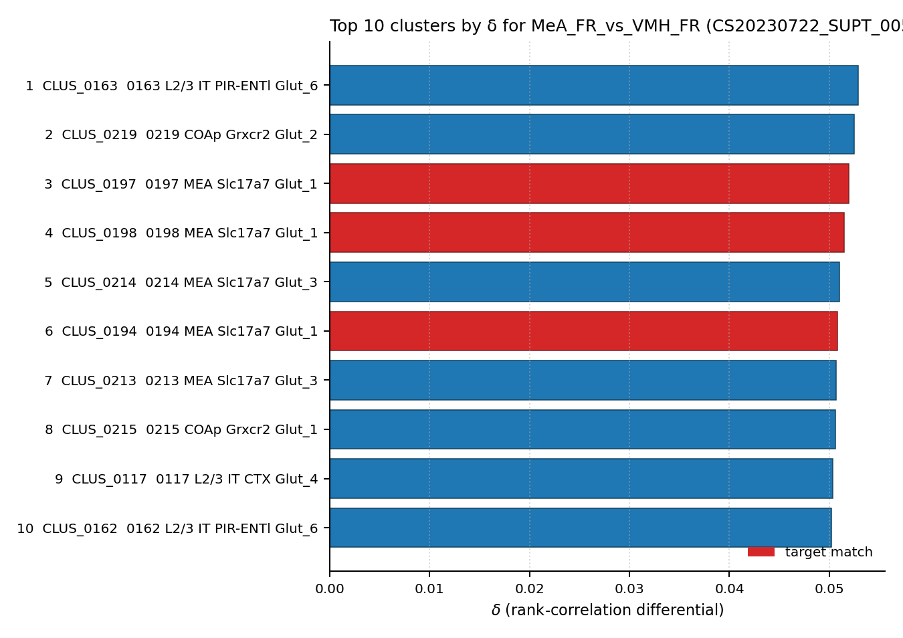

# Medial amygdala estrogen-receptor alpha neuron — WMBv1 Mapping Report
*2026-04-25 · Source: `/Users/do12/Documents/GitHub/BICAN_agentic_framework_planning/evidencell/kb/graphs/sexually_dimorphic/20260425_sexually_dimorphic_report_ingest.yaml`*

---

## Introduction

The medial amygdalar nucleus (MeA) Esr1+ population is a sexually dimorphic
glutamatergic neuron group classically implicated in male-typical
reproductive behaviour (mating, aggression). This report documents a
candidate mapping of `mea_esr1_neuron` to the WMBv1 taxonomy on the basis
of Knoedler 2022 [1] TRAP-seq bulk-correlation evidence; the classical
node itself is currently a stub awaiting full literature ingest.

### Classical type table

| Property | Value | References |
|---|---|---|
| Soma location | Medial amygdalar nucleus [MBA:403] | — |
| Defining markers | Esr1 | — |
| Definition basis | PRIOR_TRANSCRIPTOMIC | — |

*(Stub status: NT type, neuropeptides, negative markers, CL term, and
per-property literature citations are not yet populated. They will be
filled in by the pending classical literature ingest.)*

No Cell Ontology term currently covers this type — candidate for a new CL term.

---

## Results

A single candidate atlas supertype was assessed: **SUPT_0055 (0055 MEA
Slc17a7 Glut_1)** at LOW confidence, driven by Knoedler 2022 [1] TRAP-seq
bulk-correlation evidence.

### Mapping candidates table

| Rank | WMBv1 cluster | Supertype | Cells (10x) | Confidence | Key property alignment | Verdict |
|---|---|---|---:|---|---|---|
| 1 | — | 0055 MEA Slc17a7 Glut_1 (CS20230722_SUPT_0055) | 3249 | 🔴 LOW | MeA location CONSISTENT · Glut NT CONSISTENT · Esr1 CONSISTENT · male-bias CONSISTENT | Speculative |

Total edges: 1. Relationship: PARTIAL_OVERLAP.

### 0055 MEA Slc17a7 Glut_1 · 🔴 LOW

**Table 1 — Property comparison**

| Property | Classical | Supertype | Best cluster | Alignment |
|---|---|---|---|---|
| Soma location | MBA:403 (Medial amygdalar nucleus) | Medial amygdalar nucleus (primary soma across child clusters) | CLUS_0197 primary soma: Medial amygdalar nucleus | CONSISTENT |
| NT type | Glutamatergic (MeA principal neurons predominantly glutamatergic) | Glutamatergic (Slc17a7 Glut_1) | Glutamatergic | CONSISTENT |
| Esr1 expression | POSITIVE (primary defining marker) | Esr1+ by experimental design (TRAP-Cre line) | Esr1+ by TRAP-Cre design | CONSISTENT |
| Sex ratio | male-biased (MeA Esr1+ population larger in males) | not available | MFR=10.11 (CLUS_0197) — extreme male bias | CONSISTENT |

*(3 of the top-6 δ hits in Knoedler 2022 (CLUS_0197, CLUS_0198, CLUS_0194) are SUPT_0055 child clusters with MeA-primary soma and male-biased MFR; CLUS_0197 is the best match by both δ rank (3/5322) and MFR (10.11). A sister supertype SUPT_0057 also places in the top 6.)*

**Table 2 — Evidence support**

| Evidence | Type | Supports | Headline | Source |
|---|---|---|---|---|
| Knoedler 2022 TRAP-seq (MeA_FR vs VMH_FR) | Bulk transcriptomic correlation | SUPPORT | best_child_cluster=CLUS_0197 (rank 3, δ=0.0519, MFR=10.11) | [1] |

**Supporting evidence**

- Knoedler 2022 [1] Esr1+ TRAP-seq pooled MeA female-receptive vs VMH
  female-receptive identifies SUPT_0055 (MEA Slc17a7 Glut_1) as the
  dominant MeA-specific signal. Child cluster CLUS_0197 ranks #3 of 5,322
  by δ = ρ(MeA_FR) − ρ(VMH_FR), with δ=0.0519 (the highest absolute δ
  value in the entire run) and MFR=10.11 — strongly male-biased,
  consistent with the well-known sexually dimorphic male-typical MeA
  Esr1+ population.
- Multiple sister clusters from SUPT_0055 (CLUS_0194, CLUS_0198) and the
  related SUPT_0057 (CLUS_0214, CLUS_0213) also rank in the top 7, all
  with MeA, posterior amygdalar, or posterior cortical amygdalar primary
  soma — an anatomically clean signal [1].
- The supertype-level encoding ("MEA Slc17a7 Glut_1") directly matches
  the classical glutamatergic identity of MeA principal neurons.

| Rank | Cluster | Supertype | δ | MFR | Top anatomy |
|---:|---|---|---:|---:|---|
| 1 | CLUS_0163 | SUPT_0044 | 0.0529 | 0.79 | Piriform area |
| 2 | CLUS_0219 | SUPT_0059 | 0.0525 | 0.75 | Cortical amygdalar area, posterior part, medial zone |
| **3** | **CLUS_0197** | **SUPT_0055** | **0.0519** | **10.11** | **Medial amygdalar nucleus** |
| **4** | **CLUS_0198** | **SUPT_0055** | 0.0515 | 1.13 | Cortical amygdalar area, posterior part, medial zone |
| 5 | CLUS_0214 | SUPT_0057 | 0.0510 | 2.33 | Medial amygdalar nucleus |
| **6** | **CLUS_0194** | **SUPT_0055** | 0.0508 | 2.70 | Posterior amygdalar nucleus |
| 7 | CLUS_0213 | SUPT_0057 | 0.0507 | 1.56 | Cortical amygdalar area, posterior part, lateral zone |
| 8 | CLUS_0215 | SUPT_0058 | 0.0506 | 1.44 | Cortical amygdalar area, posterior part, lateral zone |
| 9 | CLUS_0117 | SUPT_0032 | 0.0503 | 1.13 | Agranular insular area, dorsal part, layer 2/3 |
| 10 | CLUS_0162 | SUPT_0044 | 0.0502 | 1.08 | Postpiriform transition area |

**Marker evidence provenance**

- **Esr1 (defining marker)** — listed without a primary citation on the
  classical node (`refs: []`). Source-side Esr1+ identity is guaranteed
  by the Knoedler 2022 [1] TRAP-Cre experimental design rather than by a
  precomputed expression cross-check on this atlas; target-side
  per-cluster Esr1 expression has not been pulled into this edge as a
  quantitative comparison. A targeted cite-traverse on the classical MeA
  Esr1+ literature (Choi 2005, Unger 2015, Yamaguchi 2020) is needed to
  anchor Esr1 as a defining marker on this node.

**Concerns**

- *(SINGLE_DATASET)* All supporting evidence on this edge is from
  Knoedler 2022 [1]. There is no independent literature replication, no
  annotation transfer, and no atlas-metadata Esr1 cross-check yet recorded.
- *(PRIOR_MAPPING_ASSUMED)* The MeA Esr1+ population is well-described in
  classical literature but was not included in the original
  sexually-dimorphic asta-report-ingest cycle. This edge is added on
  bulk-correlation evidence while the classical node itself awaits proper
  ingest — confidence is capped at LOW until that is complete.
- **Internal heterogeneity unresolved.** CLUS_0197 (MFR=10.11) and
  CLUS_0194 (MFR=2.70) within SUPT_0055 differ substantially in male bias.
  Mapping at the supertype unit may conflate functionally distinct
  male-biased subpopulations (e.g. aggression-typical vs neutral).

**What would upgrade confidence**

- Run `asta-report-ingest` or `cite-traverse` on MeA Esr1+ classical
  literature (Choi 2005, Unger 2015, Yamaguchi 2020) to upgrade
  `mea_esr1_neuron` from stub to a fully ingested classical node with
  defining-marker citations, NT-type citation, and sex-bias direction
  anchored in primary studies. Expected output: `LiteratureEvidence`
  items on this edge; lifts the LOW-confidence ceiling imposed by
  PRIOR_MAPPING_ASSUMED.
- MapMyCells annotation transfer of published MeA Esr1+ scRNA-seq data
  to WMBv1 (target F1 ≥ 0.80 at SUPERTYPE for SUPT_0055; per-cluster F1
  to test whether CLUS_0197 vs CLUS_0194 are functionally separable).
  Expected output: `AnnotationTransferEvidence` complementing the
  bulk-correlation evidence.
- Independent bulk-correlation replication using a second Esr1+ MeA pool
  from an independent dataset, to confirm the rank-3 / δ=0.0519
  placement of SUPT_0055 / CLUS_0197 is not dataset-specific. Expected
  output: an additional `BulkCorrelationEvidence` entry.

---

### Methods

Data sources, analyses, and reproducibility receipts

**Classical type definition.** `mea_esr1_neuron` is a candidate classical
node (definition_basis: PRIOR_TRANSCRIPTOMIC) with Esr1 as a single
defining marker and MBA:403 (Medial amygdalar nucleus) as soma location.
No literature citations are attached to defining markers, NT type, or
soma location on this stub — the node was added so that bulk-correlation
evidence from Knoedler 2022 [1] could land as an edge.

**Atlas mapping query.** Candidate atlas clusters were retrieved from the
WMBv1 taxonomy (CCN20230722) at ranks 0 (cluster) and 1 (supertype) using
metadata-based scoring (region match, NT type, defining markers, sex bias
when applicable). Full scoring rules: `workflows/map-cell-type.md`.

**Property alignment.** Each defining property of the classical type was
compared to the corresponding atlas-side value via the `property_comparisons`
schema, with alignments graded CONSISTENT / APPROXIMATE / DISCORDANT /
NOT_ASSESSED. Atlas-side numerical values came from precomputed expression
on the cluster (cluster.yaml in the taxonomy reference store) and from
MERFISH spatial registration for soma location.

**Bulk transcriptomic correlation.**

| Field | Value |
|---|---|
| Source publication | Knoedler et al. 2022 · PMID:35143761 [1] |
| GEO accession | GSE183092 |
| Technique | TRAP-seq |
| n pools | 12 |
| Atlas | CCN20230722 (SHA-256: b21ca985) |
| Statistic | spearman_rho |
| Parameters | pseudobulk_transform=log1p(sum/n_cells); pool_transform=log1p(replicate_mean(DESeq2_normalised_counts)); gene_id_space=ensembl_mouse_via_symbol_lookup (conf/gene_mapping_CCN20230722.tsv); gene_intersection=intersection_across_4_regions∩atlas_col_names; n_replicates_per_pool=3. |
| Script | [correlate.py](https://github.com/Cellular-Semantics/evidencell/blob/4e67d6b/kb/correlation_runs/corr_run_20260428_knoedler_esr1_wmbv1/correlate.py) |
| Code version | 4e67d6b |
| Caveats | Cross-sex within-region δ contrasts (Male vs FR or Male vs FNR) are artefactual: across all three regions tested (POA, VMH, BNST) the top hits are hindbrain Calcb cholinergic motor neurons — a global male-vs-female expression bias that swamps region-specific signals. METHODOLOGICAL RULE: paired-bulk δ requires the two pools to differ in cell population (region/marker/state) holding sex constant. TRAP-seq vs scRNA-seq pseudobulk: polysome-bound mRNA shifts absolute ρ values lower than FACS-bulk, but Spearman rank-based statistics handle the magnitude offset; δ rankings are comparable across run types. |

**Atlas data sources.**
- WMBv1 / CCN20230722 / `conf/mapmycells/CCN20230722/precomputed_stats.h5` / SHA-256: `b21ca985652fb25f9608f99005139a40757133a76fbe845ae5b175c5c26a447b`.

**Anti-hallucination.** All citations, atlas accessions, ontology CURIEs,
and verbatim literature quotes in this report are validated against the
evidencell knowledge base at write time. Authored-prose evidence
narratives are validated against their source `evidence_items[*].explanation`
fields. The pre-write hook rejects any unresolvable identifier or
unattributed blockquote. Specific mapping limitations and caveats are
documented per-candidate in the Discussion section.

*Generated by evidencell `01f89d6` at 2026-05-13T15:46:18+00:00 from [kb/graphs/sexually_dimorphic/20260425_sexually_dimorphic_report_ingest.yaml](kb/graphs/sexually_dimorphic/20260425_sexually_dimorphic_report_ingest.yaml).*

**Evidence base table**

| Edge ID | Evidence types | Supports | Source |
| --- | --- | --- | --- |
| edge_mea_esr1_neuron_to_cs20230722_supt_0055 | BULK_CORRELATION | SUPPORT | [1] |

---

## Discussion

**Primary mapping:** Medial amygdala estrogen-receptor alpha neuron → 0055
MEA Slc17a7 Glut_1 [CS20230722_SUPT_0055] at LOW confidence. Key support:
bulk-correlation δ with extreme male-biased MFR at the best child cluster
(CLUS_0197 δ=0.0519, MFR=10.11) [1]. Key caveats: SINGLE_DATASET and
PRIOR_MAPPING_ASSUMED — the classical node remains a stub pending
literature ingest, and the supertype is internally heterogeneous in
sex bias.

No Cell Ontology term currently assigned. Candidate for CL contribution
once the classical node is fully ingested.

### Proposed experiments and follow-ups

**1. Classical literature ingest on MeA Esr1+ population**

- **What**: Run `asta-report-ingest` (or targeted `cite-traverse`) on the
  canonical MeA Esr1+ literature (Choi 2005, Unger 2015, Yamaguchi 2020).
- **Target**: Attach primary citations to Esr1 as a defining marker;
  document sex-bias direction; capture any subpopulation distinctions
  (aggression-typical vs neutral).
- **Expected output**: `LiteratureEvidence` items on
  `edge_mea_esr1_neuron_to_cs20230722_supt_0055`; an upgraded
  classical-node property set with `defining_markers[*].refs`,
  `nt_refs`, and `location_refs` populated.
- **Resolves**: caveats SINGLE_DATASET and PRIOR_MAPPING_ASSUMED;
  open question 1.

**2. MapMyCells annotation transfer of MeA Esr1+ scRNA-seq**

- **What**: MapMyCells AT of a published MeA Esr1+ single-cell dataset
  onto WMBv1 (CCN20230722).
- **Target**: F1 ≥ 0.80 at SUPERTYPE for SUPT_0055; per-cluster F1 for
  CLUS_0197 vs CLUS_0194 to test whether the two male-biased clusters
  represent distinct subpopulations.
- **Expected output**: `AnnotationTransferEvidence` complementing the
  current bulk-correlation evidence.
- **Resolves**: open question 2; provides a second independent line of
  evidence to upgrade the edge past LOW.

**3. Independent bulk-correlation replication**

- **What**: Repeat the δ = ρ(MeA_FR) − ρ(VMH_FR) contrast against WMBv1
  using a second Esr1+ MeA pool from an independent dataset.
- **Target**: SUPT_0055 / CLUS_0197 retains a top-3 ranking of 5,322
  clusters by δ.
- **Expected output**: An additional `BulkCorrelationEvidence` entry.
- **Resolves**: robustness check on the primary external evidence [1].

### Open questions

1. Does the existing classical literature support a single MeA Esr1+
   classical type, or multiple subpopulations (e.g. male-typical
   aggression vs neutral)?
2. Are CLUS_0197 (MFR=10.11) and CLUS_0194 (MFR=2.70) functionally
   distinct male-biased subpopulations within SUPT_0055, or a graded
   signal across one population?

---

## References

| # | Citation | PMID | Used for |
|---|---|---|---|
| [1] | Knoedler et al. 2022 | [PMID:35143761](https://pubmed.ncbi.nlm.nih.gov/35143761/) | Esr1+ TRAP-seq pooled MeA female-receptive vs VMH female-receptive bulk-correlation evidence ranking SUPT_0055 / CLUS_0197 in the top 6 of 5,322 by δ |
