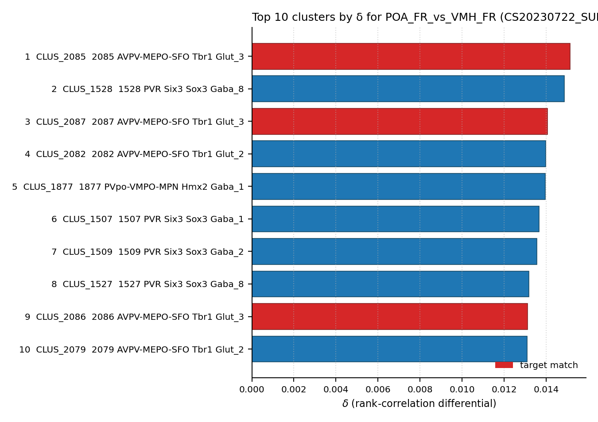

# MPOA estrogen receptor 1 (Esr1) neuron — WMBv1 Mapping Report
*2026-04-25 · Source: `/Users/do12/Documents/GitHub/BICAN_agentic_framework_planning/evidencell/kb/graphs/sexually_dimorphic/20260425_sexually_dimorphic_report_ingest.yaml`*

---

## Introduction

The medial preoptic area (MPOA) is a sexually dimorphic hypothalamic structure that houses molecularly heterogeneous neuronal populations, including a steroid-receptor-expressing class defined by Esr1 (estrogen receptor 1), Ar (androgen receptor), and Pgr (progesterone receptor) [1][2]. MPOA Esr1+ neurons are required, alongside galanin neurons, for pup-directed/parental behavior; Esr1 governs male-type mating behaviour while overlapping Nts+ neurons govern female socio-sexual behaviours [1]. Because the MPOA contains both GABAergic and glutamatergic Esr1+ subpopulations, the classical type as written here spans more than one transcriptomic supertype and may need to be split.

### Classical type table

| Property | Value | References |
|---|---|---|
| Soma location | Medial preoptic area [MBA:523] | [1] |
| Defining markers | Esr1, Ar, Pgr | [1], [2] |
| NT type | Mixed (GABAergic and glutamatergic both documented in MPOA) | [1] |

<details>
<summary>Details — source evidence for classical type properties</summary>

- **Soma location:** classical review · mouse · [1]
  > A large hypothalamic structure, the MPOA sends projections to multiple downstream brain regions and is both larger and contains more neurons in males than in females [35]. Notably, the MPOA is home to various heterogeneous, molecularly defined, neuronal clusters, including many sexually dimorphic populations, such as androgen receptor (AR)-expressing population and estrogen receptor alpha (ESR1)expressing population [80]
  > — Zilkha et al. 2021, Sexually Dimorphic Brain Regions and Structures · [1] <!-- quote_key: 233446934_5d0fb07e -->

- **Esr1 marker (parental-behaviour subpopulation):**
  > At least two different subpopulations within the MPOA were shown to be required for the regulation of pupdirected behavior. The first is the ESR1 þ population, which is highly sexually dimorphic in its distribution and projection patterns [85]
  > — Zilkha et al. 2021, Sexually Dimorphic Brain Regions and Structures · [1] <!-- quote_key: 233446934_9f0f55ea -->

- **Esr1 / Ar / Pgr co-expression in MPOA:**
  > Since the MPOA is enriched in the expression of steroid hormone receptors genes (e.g., Esr1, androgen receptor (Ar), progesterone receptor (Pgr))
  > — Hashikawa et al. 2021, Neuronal Markers and Molecular Characteristics · [2] <!-- quote_key: 237425192_b8087ed0 -->

- **Functional partition (Esr1 vs Gal vs Nts subpopulations):**
  > Molecularly defined subpopulations of neurons expressing a variety of neuropeptides and/or hormonal receptors in the MPOA are tightly associated with reproductive behaviors. MPOA neurons expressing Gal (galanin) or Esr1 (estrogen receptor 1) are essential for parental behaviors, while MPOA neurons expressing Esr1 or Nts (neurotensin) govern male-type mating behaviors and female socio-sexual behaviors, respectively
  > — Hashikawa et al. 2021, Neuronal Markers and Molecular Characteristics · [2] <!-- quote_key: 237425192_c17e0213 -->

</details>

No Cell Ontology term currently covers this type — candidate for a new CL term.

---

## Results

The current evidence supports a **two-component mapping**: a GABAergic preoptic Esr1+ supertype, 0486 PVpo-VMPO-MPN Hmx2 Gaba_5 [CS20230722_SUPT_0486], where atlas precomputed expression confirms all three defining steroid-receptor markers (Esr1 mean=7.72 defining, Ar=8.15, Pgr=6.80) and MPN-encoded anatomical labelling matches the classical soma location; and a glutamatergic preoptic Esr1+ supertype, 0521 AVPV-MEPO-SFO Tbr1 Glut_3 [CS20230722_SUPT_0521], identified by Knoedler 2022 TRAP-seq of Esr1+ POA female-receptive vs VMH female-receptive cells, whose top-ranked atlas cluster (CLUS_2085, δ=0.0151, rank 1 of 5,322) and three further top-10 hits are AVPV-MEPO-SFO Tbr1 Glut_3 child clusters [3] (see figure and property comparison tables). The remaining ten preoptic-region candidates from Stage A carry only anatomical location signal — no atlas-side expression for Esr1/Ar/Pgr — and do not differentiate.

### 0486 PVpo-VMPO-MPN Hmx2 Gaba_5 [CS20230722_SUPT_0486] · 🟡 MODERATE

**Table 1 — Property comparison**

| Property | Classical | Supertype | Best cluster | Alignment |
|---|---|---|---|---|
| Soma location | Medial preoptic area [MBA:523] | MBA:515 (MPN) n=37; MBA:133 (PVpo) n=64; MBA:272 (AVPV) n=16 | not assessed | CONSISTENT |
| NT type | Mixed (GABAergic + glutamatergic) | GABAergic (PVpo-VMPO-MPN Hmx2 Gaba subclass) | not assessed | APPROXIMATE |
| Esr1 | Defining marker (POSITIVE, transcript) | precomputed mean_expression = 7.72 (DEFINING atlas marker) | not assessed | CONSISTENT |
| Ar | Defining marker (POSITIVE, transcript) | precomputed mean_expression = 8.15 | not assessed | CONSISTENT |
| Pgr | Defining marker (POSITIVE, transcript) | precomputed mean_expression = 6.80 | not assessed | CONSISTENT |
| Sex ratio | Not documented at supertype level | not available | not assessed | NOT_ASSESSED |

*(Child-cluster breakdown not assessed — see proposed experiments. Supertype-level Esr1/Ar/Pgr are concordant; whether all child clusters share this profile or whether a specific MPN-resident child dominates remains to be resolved.)*

**Table 2 — Evidence support**

| Evidence | Type | Supports | Headline | Source |
|---|---|---|---|---|
| Atlas precomputed expression (defining markers) | Atlas metadata | SUPPORT | Esr1=7.72 (DEFINING), Ar=8.15, Pgr=6.80; MPN n=37 | atlas-internal |

**Supporting evidence**

- Atlas precomputed expression on SUPT_0486 confirms all three defining steroid-receptor markers at high mean expression; Esr1 carries the DEFINING atlas marker tag. The supertype's label directly encodes MPN, and 37 cells from MBA:515 (MPN, the same anatomical structure as the classical MBA:523 medial preoptic area) sit in this supertype, alongside PVpo and AVPV-resident cells.

**Concerns**

- AMBIGUOUS_MAPPING: SUPT_0486 captures only the GABAergic fraction of the classical Esr1+ MPOA population. The glutamatergic fraction has its own preoptic transcriptomic identity (see SUPT_0521 below), so this edge alone cannot represent the full classical type.
- DISTRIBUTED_ACROSS_CLUSTERS: the functional partition of MPOA Esr1+ cells (parental, male mating, female socio-sexual via Nts+) likely distributes across multiple SUPT_0486 child clusters, none of which has been pinned down here.
- *(note: this edge was not refreshed in the 2026-06-08 property_comparisons sweep — it currently sits outside the Stage A top-50 at rank 1 and warrants curator review before it is relied on; cf. Cellular-Semantics/evidencell#111.)*

**What would upgrade confidence**

- Cluster-level resolution within SUPT_0486 quantifying which child has the strongest joint Esr1/Ar/Pgr profile and the densest MPN soma assignment.
- ISH/MERFISH co-staining of Esr1 with Slc32a1 (vGAT) and Slc17a6 (vGlut2) in MPOA to quantify the GABA vs Glut split of the classical population.
- Annotation transfer of published MPOA Esr1+ transcriptomic data (e.g. Moffitt 2018) to SUPT_0486; F1 ≥ 0.5 at supertype level with a clear best-child would lift confidence.

### 0521 AVPV-MEPO-SFO Tbr1 Glut_3 [CS20230722_SUPT_0521] · 🟡 MODERATE

**Table 1 — Property comparison**

| Property | Classical | Supertype | Best cluster | Alignment |
|---|---|---|---|---|
| Soma location | Medial preoptic area [MBA:523] | MBA:1097 Hypothalamus count_100um=311; MBA:129 third ventricle count_100um=254; MBA:452 Median preoptic nucleus count_100um=183 | CLUS_2085 top_anat = Anteroventral periventricular nucleus, n=29 | APPROXIMATE |
| NT type | Mixed (GABAergic + glutamatergic) | Glutamatergic (Tbr1 Glut_3 subclass) | Glutamatergic | APPROXIMATE |
| Esr1 | Defining marker (POSITIVE, transcript) | no atlas expression data | no atlas expression data | NOT_ASSESSED |
| Ar | Defining marker (POSITIVE, transcript) | no atlas expression data | no atlas expression data | NOT_ASSESSED |
| Pgr | Defining marker (POSITIVE, transcript) | no atlas expression data | no atlas expression data | NOT_ASSESSED |
| Sex ratio | Not documented | not available | MFR=1.5 (CLUS_2085) | NOT_ASSESSED |

*(Child-cluster breakdown: four of the top ten atlas clusters ranked by δ on the POA_FR vs VMH_FR contrast are SUPT_0521 children — CLUS_2085, 2087, 2086, plus rank-4/rank-10 children of the sister Glut_2 supertype SUPT_0520. The best child CLUS_2085 sits primarily in the Anteroventral periventricular nucleus, which is a known POA-Esr1+ female-biased subregion, while the classical node's soma annotation is the broader Medial preoptic area — `region_fraction_100um: 0.138` is in the boundary band, reflecting that Knoedler's POA dissection captures a broader preoptic zone than MPN proper.)*

**Table 2 — Evidence support**

| Evidence | Type | Supports | Headline | Source |
|---|---|---|---|---|
| Knoedler 2022 TRAP-seq | Bulk transcriptomic correlation | SUPPORT | best_child=CLUS_2085 (rank 1 of 5322, δ=0.0151) | [3] |
| Stage A anatomical metadata | Atlas metadata | PARTIAL | region_fraction_100um=0.138 (boundary) | atlas-internal |

Knoedler 2022 [3] performed Esr1+ TRAP-seq on pooled POA female-receptive vs VMH female-receptive cells, and pseudobulk-correlation against WMBv1 cluster pseudobulks places SUPT_0521 (AVPV-MEPO-SFO Tbr1 Glut_3, glutamatergic) child cluster CLUS_2085 at rank #1 of 5,322 atlas clusters by δ = ρ(POA_FR) − ρ(VMH_FR), with δ=0.0151 and primary soma in the Anteroventral periventricular nucleus. Three additional SUPT_0521 child clusters (2087, 2082, 2079) appear in the top 10. This is the dominant POA-Esr1+ supertype by bulk correlation but is glutamatergic, not GABAergic like the existing SUPT_0486 mapping — suggesting that the classical mpoa_esr1_neuron node may be heterogeneous and need a glut/GABA split, or that SUPT_0486 captures only a subset of the classical population.



| Rank | Cluster | Supertype | δ | MFR | Top anatomy |
|---:|---|---|---:|---:|---|
| **1** | **CLUS_2085** | **SUPT_0521** | **0.0151** | **1.5** | **Anteroventral periventricular nucleus** |
| 2 | CLUS_1528 | SUPT_0418 | 0.0149 | 1.04 | choroid plexus |
| **3** | **CLUS_2087** | **SUPT_0521** | **0.0141** | **1.33** | **Anteroventral periventricular nucleus** |
| 4 | CLUS_2082 | SUPT_0520 | 0.0140 | 1.86 | Median preoptic nucleus |
| 5 | CLUS_1877 | SUPT_0482 | 0.0140 | 2.57 | optic chiasm |
| 6 | CLUS_1507 | SUPT_0411 | 0.0137 | 1.04 | Anteroventral periventricular nucleus |
| 7 | CLUS_1509 | SUPT_0412 | 0.0136 | 1.7 | Retrochiasmatic area |
| 8 | CLUS_1527 | SUPT_0418 | 0.0132 | 1.56 | Median preoptic nucleus |
| **9** | **CLUS_2086** | **SUPT_0521** | **0.0131** | **1.08** | Median preoptic nucleus |
| 10 | CLUS_2079 | SUPT_0520 | 0.0131 | 0.96 | Anteroventral periventricular nucleus |

(Bold rows are SUPT_0521 children.)

**Supporting evidence**

- Knoedler 2022 Esr1+ TRAP-seq on dissected POA tissue from female-receptive mice, pseudobulk-correlated against WMBv1 cluster-level pseudobulks under a paired δ contrast (POA_FR vs VMH_FR), ranks CLUS_2085 first of 5,322 atlas clusters and places four SUPT_0521 / sister-Glut supertype children in the top 10 [3]. This concentrates the bulk Esr1+ POA signal on a single glutamatergic preoptic supertype.
- Anatomical scatter on SUPT_0521 is consistent with AVPV/MePO Esr1+ cells being captured by Knoedler's preoptic dissection rather than restricted to MPN proper — see boundary fraction noted below.

**Concerns**

- Atlas-side Esr1/Ar/Pgr expression are NOT_ASSESSED on this supertype (the genes are absent from the Stage A `expression_detail` and from the precomputed expression matrix queried), so direct confirmation that SUPT_0521 cells are themselves Esr1+ comes from Knoedler's TRAP-seq pulldown, not from the atlas-side. *(note: a targeted query of the atlas precomputed-stats HDF5 for Esr1/Ar/Pgr at SUPT_0521 and its child clusters would close this gap; see proposed experiments.)*
- Location is APPROXIMATE: `region_fraction_100um: 0.138` (boundary scatter — could reflect that the classical node's MBA:523 soma label is narrower than Knoedler's preoptic dissection footprint; the atlas anatomical assignment for SUPT_0521 is dominated by Hypothalamus, third ventricle, and Median preoptic nucleus rather than MPOA strictly). The classical type as currently written may need to be either broadened to "preoptic Esr1+" or split between MPN-resident GABAergic and AVPV/MePO-resident glutamatergic subnodes.
- AMBIGUOUS_MAPPING: co-primary alongside SUPT_0486. The two supertypes capture different NT-typed Esr1+ preoptic populations; the classical node may need to be split or narrowed.
- ATLAS_DISSECTION_OVERLAP: Knoedler's "POA" dissection extends beyond MPN proper into AVPV and MePO; the SUPT_0521 signal partly reflects that capture.

**What would upgrade confidence**

- Targeted query of the WMBv1 precomputed expression HDF5 for Esr1, Ar, Pgr at SUPT_0521 and its top child clusters — direct atlas-side confirmation that these are Esr1+ glutamatergic cells.
- ISH or MERFISH co-staining for Esr1, Slc17a6 (vGlut2), Slc32a1 (vGAT) in MPOA to quantify the GABAergic vs glutamatergic fractions of Esr1+ cells in MPN proper vs AVPV/MePO.
- Cluster annotation transfer of published MPOA Esr1+ transcriptomic data (e.g. Moffitt 2018) split between SUPT_0521 and SUPT_0486; the predicted split would substantiate the GABA/Glut subdivision.

<details>
<summary>### Candidates audited (full top-K)</summary>

| WMBv1 cluster | Supertype | Cells (10x) | Confidence | Key evidence | Verdict |
|---|---|---:|---|---|---|
| 0486 PVpo-VMPO-MPN Hmx2 Gaba_5 [CS20230722_SUPT_0486] | — | 933 | 🟡 MODERATE | Atlas Esr1/Ar/Pgr all high; DEFINING atlas marker | Primary (GABAergic component) |
| 0521 AVPV-MEPO-SFO Tbr1 Glut_3 [CS20230722_SUPT_0521] | — | 690 | 🟡 MODERATE | Knoedler δ rank 1 of 5322; 4/10 top hits SUPT_0521 children | Primary (glutamatergic component) |
| 1466 MPO-ADP Lhx8 Gaba_3 [CS20230722_CLUS_1466] | 0404 MPO-ADP Lhx8 Gaba_3 | 157 | 🔴 LOW | region_fraction_100um=0.529; no atlas Esr1/Ar/Pgr | Eliminated (no marker evidence) |
| 1536 PVR Six3 Sox3 Gaba_9 [CS20230722_CLUS_1536] | 0419 PVR Six3 Sox3 Gaba_9 | 145 | 🔴 LOW | region_fraction_100um=0.694; no atlas Esr1/Ar/Pgr | Eliminated (no marker evidence) |
| 1885 PVpo-VMPO-MPN Hmx2 Gaba_1 [CS20230722_CLUS_1885] | 0482 PVpo-VMPO-MPN Hmx2 Gaba_1 | 36 | 🔴 LOW | region_fraction_100um=0.750; no atlas Esr1/Ar/Pgr | Eliminated (no marker evidence) |
| 1887 PVpo-VMPO-MPN Hmx2 Gaba_1 [CS20230722_CLUS_1887] | 0482 PVpo-VMPO-MPN Hmx2 Gaba_1 | 140 | 🔴 LOW | region_fraction_100um=0.612; no atlas Esr1/Ar/Pgr | Eliminated (no marker evidence) |
| 2118 ADP-MPO Trp73 Glut_1 [CS20230722_CLUS_2118] | 0527 ADP-MPO Trp73 Glut_1 | 81 | 🔴 LOW | region_fraction_100um=0.818; no atlas Esr1/Ar/Pgr | Eliminated (no marker evidence) |
| 0419 PVR Six3 Sox3 Gaba_9 [CS20230722_SUPT_0419] | — | 620 | 🔴 LOW | region_fraction_100um=0.560; no atlas Esr1/Ar/Pgr | Eliminated (no marker evidence) |
| 0403 MPO-ADP Lhx8 Gaba_2 [CS20230722_SUPT_0403] | — | 627 | 🔴 LOW | region_fraction_100um=0.641; no atlas Esr1/Ar/Pgr | Eliminated (no marker evidence) |
| 0401 SI-MPO-LPO Lhx8 Gaba_6 [CS20230722_SUPT_0401] | — | 48 | 🔴 LOW | region_fraction_100um=0.812; no atlas Esr1/Ar/Pgr | Eliminated (no marker evidence) |
| 0348 MEA-BST Lhx6 Sp9 Gaba_2 [CS20230722_SUPT_0348] | — | 675 | 🔴 LOW | region_fraction_100um=0.203; medial amygdala / BNST resident | Eliminated (off-target region) |
| 0398 SI-MPO-LPO Lhx8 Gaba_3 [CS20230722_SUPT_0398] | — | 686 | 🔴 LOW | region_fraction_100um=0.568; no atlas Esr1/Ar/Pgr | Eliminated (no marker evidence) |

</details>

---

### Methods

<details>
<summary>Data sources, analyses, and reproducibility receipts</summary>

**Classical type definition.** The classical type `mpoa_esr1_neuron` is defined under `definition_basis: CLASSICAL_NEUROCHEMICAL` with defining markers Esr1, Ar, Pgr; soma in the Medial preoptic area [MBA:523]; NT type heterogeneous (GABAergic + glutamatergic both documented). Sources: Zilkha et al. 2021 [1] for soma location and Esr1+ MPOA dimorphism; Hashikawa et al. 2021 [2] for Esr1 / Ar / Pgr co-expression and the parental / mating / socio-sexual functional partition.

**Atlas mapping query.** Candidate atlas clusters were retrieved from the WMBv1 taxonomy (CCN20230722) at ranks 0 (cluster) and 1 (supertype) using metadata-based scoring (region match, NT type, defining markers, sex bias when applicable). Full scoring rules: `workflows/map-cell-type.md`.

**Property alignment.** Each defining property of the classical type was compared to the corresponding atlas-side value via the `property_comparisons` schema, with alignments graded CONSISTENT / APPROXIMATE / DISCORDANT / NOT_ASSESSED. Atlas-side numerical values came from precomputed expression on the cluster (cluster.yaml in the taxonomy reference store) and from MERFISH spatial registration for soma location.

**Bulk transcriptomic correlation.**

| Field | Value |
|---|---|
| Source publication | Knoedler et al. 2022, *A functional cellular framework for sex and estrous cycle-dependent gene expression and behavior* · [3] |
| GEO accession | GSE183092 |
| Technique | TRAP-seq |
| n pools | 12 |
| Atlas | CCN20230722 (SHA-256: b21ca985) |
| Statistic | spearman_rho |
| Parameters | pseudobulk_transform=log1p(sum/n_cells); pool_transform=log1p(replicate_mean(DESeq2_normalised_counts)); gene_id_space=ensembl_mouse_via_symbol_lookup; gene_intersection=intersection_across_4_regions∩atlas_col_names; n_replicates_per_pool=3. |
| Script | [correlate.py](https://github.com/Cellular-Semantics/evidencell/blob/4e67d6b/kb/correlation_runs/corr_run_20260428_knoedler_esr1_wmbv1/correlate.py) |
| Code version | 4e67d6b |
| Caveats | Cross-sex within-region δ contrasts (Male vs FR or Male vs FNR) are artefactual: top hits are hindbrain Calcb cholinergic motor neurons reflecting a global male-vs-female expression bias. METHODOLOGICAL RULE: paired-bulk δ requires the two pools to differ in cell population holding sex constant. TRAP-seq vs scRNA pseudobulk: polysome-bound mRNA shifts absolute ρ values lower, but Spearman rank-based δ rankings are comparable across run types. |

**Atlas data sources.** WMBv1 (CCN20230722) · `conf/mapmycells/CCN20230722/precomputed_stats.h5` · SHA-256 `b21ca985652fb25f9608f99005139a40757133a76fbe845ae5b175c5c26a447b`.

**Anti-hallucination.** All citations, atlas accessions, ontology CURIEs, and verbatim literature quotes in this report are validated against the evidencell knowledge base at write time. Authored-prose evidence narratives are validated against their source `evidence_items[*].explanation` fields. The pre-write hook rejects any unresolvable identifier or unattributed blockquote. Specific mapping limitations and caveats are documented per-candidate in the Discussion section.

*Generated by evidencell `25c2b32` at 2026-06-08T18:14:05+00:00 from [kb/graphs/sexually_dimorphic/20260425_sexually_dimorphic_report_ingest.yaml](kb/graphs/sexually_dimorphic/20260425_sexually_dimorphic_report_ingest.yaml).*

<details>
<summary>Evidence base table</summary>

| Edge ID | Evidence types | Supports | Source |
|---|---|---|---|
| edge_mpoa_esr1_neuron_to_cs20230722_supt_0486 | ATLAS_METADATA | SUPPORT | atlas-internal |
| edge_mpoa_esr1_neuron_to_cs20230722_supt_0521 | BULK_CORRELATION | SUPPORT | [3] |
| edge_mpoa_esr1_neuron_to_CS20230722_CLUS_1466 | ATLAS_METADATA | PARTIAL | atlas-internal |
| edge_mpoa_esr1_neuron_to_CS20230722_CLUS_1536 | ATLAS_METADATA | PARTIAL | atlas-internal |
| edge_mpoa_esr1_neuron_to_CS20230722_CLUS_1885 | ATLAS_METADATA | PARTIAL | atlas-internal |
| edge_mpoa_esr1_neuron_to_CS20230722_CLUS_1887 | ATLAS_METADATA | PARTIAL | atlas-internal |
| edge_mpoa_esr1_neuron_to_CS20230722_CLUS_2118 | ATLAS_METADATA | PARTIAL | atlas-internal |
| edge_mpoa_esr1_neuron_to_CS20230722_SUPT_0419 | ATLAS_METADATA | PARTIAL | atlas-internal |
| edge_mpoa_esr1_neuron_to_CS20230722_SUPT_0403 | ATLAS_METADATA | PARTIAL | atlas-internal |
| edge_mpoa_esr1_neuron_to_CS20230722_SUPT_0401 | ATLAS_METADATA | PARTIAL | atlas-internal |
| edge_mpoa_esr1_neuron_to_CS20230722_SUPT_0348 | ATLAS_METADATA | PARTIAL | atlas-internal |
| edge_mpoa_esr1_neuron_to_CS20230722_SUPT_0398 | ATLAS_METADATA | PARTIAL | atlas-internal |

</details>

</details>

---

## Discussion

### Best candidate + caveats summary

**Primary mapping:** MPOA estrogen receptor 1 (Esr1) neuron → two co-primary supertypes — 0486 PVpo-VMPO-MPN Hmx2 Gaba_5 [CS20230722_SUPT_0486] (GABAergic component) and 0521 AVPV-MEPO-SFO Tbr1 Glut_3 [CS20230722_SUPT_0521] (glutamatergic component), both at MODERATE confidence. Key support: atlas precomputed expression of Esr1/Ar/Pgr on SUPT_0486; Knoedler 2022 TRAP-seq δ rank-1 (CLUS_2085) plus 4-of-top-10 SUPT_0521 children on SUPT_0521. Key caveats: AMBIGUOUS_MAPPING (the classical type spans GABAergic and glutamatergic Esr1+ preoptic subpopulations); DISTRIBUTED_ACROSS_CLUSTERS (functional subpartitions — parental / male mating / female socio-sexual — likely distribute across child clusters within each supertype).

No Cell Ontology term currently assigned. Candidate for new CL term(s); given the GABA/Glut split documented here, two CL contributions may be appropriate rather than one.

### Proposed experiments and follow-ups

1. **Atlas-side marker confirmation on SUPT_0521.** Query the WMBv1 precomputed-stats HDF5 for Esr1, Ar, Pgr at SUPT_0521 and its top child clusters (CLUS_2085, 2087, 2086). Target: detect Esr1 ≥ MIN_DETECTABLE on at least one Tbr1 Glut_3 child cluster. Expected output: ATLAS_METADATA evidence items strengthening or refuting the SUPT_0521 mapping. Resolves: edge_mpoa_esr1_neuron_to_cs20230722_supt_0521 open marker NOT_ASSESSED rows.
2. **ISH/MERFISH co-staining for Esr1 with Slc17a6 (vGlut2) and Slc32a1 (vGAT) in MPOA.** Target: quantify GABA vs Glut fractions of Esr1+ cells in MPN proper vs AVPV/MePO. Expected output: MarkerAnalysisEvidence + LiteratureEvidence supporting or refuting the GABA/Glut subdivision of the classical type. Resolves: AMBIGUOUS_MAPPING caveat on both primary edges; open question 1 (whether to split the classical node).
3. **Cluster annotation transfer of published MPOA Esr1+ transcriptomic data (e.g. Moffitt 2018).** Target: F1 ≥ 0.5 at supertype level on each of SUPT_0486 and SUPT_0521, with a clear best child within each. Expected output: AnnotationTransferEvidence quantifying which classical Esr1+ functional subpopulations land on which transcriptomic supertype. Resolves: DISTRIBUTED_ACROSS_CLUSTERS caveat; open questions 2 and 4.
4. **Curator review of edge_mpoa_esr1_neuron_to_cs20230722_supt_0486.** The edge property comparisons were not refreshed in the 2026-06-08 sweep; SUPT_0486 currently sits outside the Stage A top-50 at rank 1. Re-run Stage A and confirm or retire (cf. Cellular-Semantics/evidencell#111).

### Open questions

1. Should `mpoa_esr1_neuron` be split into GABAergic (SUPT_0486) and glutamatergic (SUPT_0521) subnodes, or narrowed to MPN-proper Esr1+ neurons?
2. Which clusters within SUPT_0486 have the highest joint Esr1/Ar/Pgr expression and the strongest MPN anatomical signal?
3. Does the Nts+ female socio-sexual subpopulation map to SUPT_0486 (GABAergic) or to a separate preoptic supertype?
4. Is the AVPV/MePO Esr1+ population (SUPT_0521) functionally distinct from MPN-proper Esr1+ (SUPT_0486) in the parental / mating circuit literature?
5. The legacy edge to SUPT_0486 fell outside the current Stage A top-50 and warrants curator review before being relied on (cf. Cellular-Semantics/evidencell#111).

---

## References

| # | Citation | Identifier | Used for |
|---|---|---|---|
| [1] | Zilkha et al. 2021 | [PubMed](https://pubmed.ncbi.nlm.nih.gov/33910083/) | Soma location; MPOA Esr1+ sexual dimorphism; Esr1+ parental subpopulation |
| [2] | Hashikawa et al. 2021 (bioRxiv) | DOI:10.1101/2021.09.02.458782 | Esr1 / Ar / Pgr co-expression in MPOA; Esr1 / Gal / Nts functional partition |
| [3] | Knoedler et al. 2022, *A functional cellular framework for sex and estrous cycle-dependent gene expression and behavior* | GSE183092 | Esr1+ TRAP-seq pooled POA female-receptive vs VMH female-receptive bulk correlation |

---

<!-- verdict-block-start: edge_mpoa_esr1_neuron_to_cs20230722_supt_0486 -->
```yaml
verdict:
  confidence: MODERATE
  confidence_score: 0.55
  relationship: skos:broadMatch
  mapping_cardinality: "1:n"
  mapping_justification: semapv:ManualMappingCuration
  rationale: >
    [tier:STRONGEST] Atlas precomputed expression on CS20230722_SUPT_0486
    confirms all three classical defining markers (Esr1=7.72 DEFINING,
    Ar=8.15, Pgr=6.80) and the supertype carries MBA:515 (MPN) cells
    concordant with the classical MBA:523 soma label; this captures the
    GABAergic component of the Esr1+ MPOA population. Co-primary with
    CS20230722_SUPT_0521 (glutamatergic component). Property comparisons
    on this edge were not refreshed in the 2026-06-08 sweep; the edge
    sits outside the current Stage A top-50 at rank 1 and warrants
    curator review (cf. evidencell#111).
  reconciliation_note: >
    Paired with CS20230722_SUPT_0521 as co-primary: SUPT_0486 captures
    the GABAergic fraction, SUPT_0521 the glutamatergic fraction of the
    classical Esr1+ MPOA population. Together they argue for splitting
    the classical node or narrowing it to MPN-proper.
  caveats:
    - caveat_type: AMBIGUOUS_MAPPING
      description: >
        MPOA Esr1+ neurons are functionally heterogeneous (parental
        behavior, male mating, female socio-sexual via Nts+). The
        classical node spans multiple transcriptomic supertypes;
        CS20230722_SUPT_0486 captures only the GABAergic fraction.
    - caveat_type: DISTRIBUTED_ACROSS_CLUSTERS
      description: >
        Functional subpopulations (parental, mating, female
        socio-sexual) likely distribute across multiple child clusters
        within CS20230722_SUPT_0486.
    - caveat_type: OTHER
      description: >
        Property comparisons on this edge were not refreshed in the
        2026-06-08 Stage A sweep; the edge sits outside the current
        top-50 at rank 1 and warrants curator review (cf. evidencell#111).
  proposed_experiments:
    - >
      Cluster-level resolution within CS20230722_SUPT_0486 quantifying
      which child cluster has the strongest joint Esr1/Ar/Pgr profile
      and densest MPN anatomical signal. Expected output:
      ATLAS_METADATA and MarkerAnalysisEvidence.
    - >
      ISH or MERFISH co-staining for Esr1, Slc32a1 (vGAT) and
      Slc17a6 (vGlut2) in MPOA to quantify the GABA vs Glut split of
      Esr1+ cells. Expected output: MarkerAnalysisEvidence.
    - >
      Cluster annotation transfer of published MPOA Esr1+
      transcriptomic data (e.g. Moffitt 2018) onto
      CS20230722_SUPT_0486 vs CS20230722_SUPT_0521; target F1 >= 0.5
      at supertype level with a clear best-child.
  unresolved_questions:
    - >
      Which clusters within CS20230722_SUPT_0486 have highest
      Esr1/Ar/Pgr and strongest MPN anatomical signal?
    - >
      Does the Nts+ female socio-sexual subpopulation map to
      CS20230722_SUPT_0486 or to a separate preoptic supertype?
    - >
      Curator review of edge_mpoa_esr1_neuron_to_cs20230722_supt_0486:
      property_comparisons not refreshed in 2026-06-08 sweep; edge
      outside current Stage A top-50 (cf. evidencell#111).
```
<!-- verdict-block-end -->

<!-- verdict-block-start: edge_mpoa_esr1_neuron_to_cs20230722_supt_0521 -->
```yaml
verdict:
  confidence: MODERATE
  confidence_score: 0.55
  relationship: skos:broadMatch
  mapping_cardinality: "1:n"
  mapping_justification: semapv:ManualMappingCuration
  rationale: >
    [tier:NEXT] Knoedler 2022 (GSE183092) Esr1+ TRAP-seq POA_FR vs
    VMH_FR bulk-correlation ranks a CS20230722_SUPT_0521 child cluster
    first of 5322 atlas clusters (delta=0.0151), with three further
    CS20230722_SUPT_0521 child clusters in the top 10, concentrating
    the bulk Esr1+ preoptic signal on a single glutamatergic
    supertype. Co-primary with
    CS20230722_SUPT_0486 (GABAergic component). Location is APPROXIMATE
    (region_fraction_100um: 0.138) because Knoedler's POA dissection
    captures a broader preoptic zone (AVPV/MePO) than MPN proper.
    Atlas-side Esr1/Ar/Pgr expression is NOT_ASSESSED on this
    supertype - direct atlas-side marker confirmation is the
    next-step gap.
  reconciliation_note: >
    Paired with CS20230722_SUPT_0486 as co-primary: SUPT_0521 captures
    the glutamatergic fraction, SUPT_0486 the GABAergic fraction of
    the classical Esr1+ MPOA population.
  caveats:
    - caveat_type: AMBIGUOUS_MAPPING
      description: >
        Co-primary candidate alongside
        edge_mpoa_esr1_neuron_to_cs20230722_supt_0486. The two
        supertypes capture different NT-typed Esr1+ preoptic
        populations; the classical node may need to be split
        (mpoa_esr1_neuron_GABAergic vs mpoa_esr1_neuron_glutamatergic)
        or narrowed to MPN proper.
    - caveat_type: OTHER
      description: >
        ATLAS_DISSECTION_OVERLAP - Knoedler's "POA" dissection
        captures a broader preoptic zone than MPN proper; AVPV and
        MePO Esr1+ neurons (anatomically anterior to MPN) are likely
        included in the bulk pool and contribute to the
        CS20230722_SUPT_0521 signal. Reflected in
        region_fraction_100um: 0.138 (boundary scatter).
    - caveat_type: OTHER
      description: >
        Atlas-side Esr1, Ar, Pgr expression are NOT_ASSESSED at
        CS20230722_SUPT_0521 (genes absent from Stage A
        expression_detail and precomputed expression). Direct
        atlas-side marker confirmation is the highest-priority
        follow-up.
  proposed_experiments:
    - >
      Targeted query of the WMBv1 precomputed-stats HDF5 for Esr1,
      Ar, Pgr at CS20230722_SUPT_0521 and its top child clusters
      (the Knoedler 2022 POA_FR vs VMH_FR bulk-correlation top
      hits). Target detect Esr1 >= MIN_DETECTABLE on at least one
      Tbr1 Glut_3 child cluster.
    - >
      ISH or MERFISH co-staining for Esr1, Slc17a6 (vGlut2),
      Slc32a1 (vGAT) in MPOA to quantify the GABA vs Glut fractions
      of Esr1+ cells in MPN proper vs AVPV/MePO.
    - >
      Cluster annotation transfer of published MPOA Esr1+
      transcriptomic data (e.g. Moffitt 2018) onto
      CS20230722_SUPT_0521 vs CS20230722_SUPT_0486; expected F1
      split between the two supertypes.
  unresolved_questions:
    - >
      Should mpoa_esr1_neuron be split into GABAergic
      (CS20230722_SUPT_0486) and glutamatergic
      (CS20230722_SUPT_0521) subnodes, or narrowed to MPN-proper
      Esr1+ neurons?
    - >
      Is the AVPV/MePO Esr1+ population (CS20230722_SUPT_0521)
      functionally distinct from MPN Esr1+ (CS20230722_SUPT_0486)
      in the parental/mating circuit literature?
```
<!-- verdict-block-end -->

<!-- verdict-block-start: edge_mpoa_esr1_neuron_to_CS20230722_CLUS_1466 -->
```yaml
verdict:
  confidence: LOW
  confidence_score: 0.2
  rationale: >
    [tier:CUT] CS20230722_CLUS_1466 sits in MPO-ADP with
    region_fraction_100um=0.529 but carries no atlas-side
    expression for Esr1, Ar, or Pgr; anatomical proximity alone is
    insufficient to map a steroid-receptor-defined classical type.
```
<!-- verdict-block-end -->

<!-- verdict-block-start: edge_mpoa_esr1_neuron_to_CS20230722_CLUS_1536 -->
```yaml
verdict:
  confidence: LOW
  confidence_score: 0.2
  rationale: >
    [tier:CUT] CS20230722_CLUS_1536 (PVR Six3 Sox3 Gaba_9) carries
    only an anatomical proximity signal (region_fraction_100um=0.694)
    with no atlas-side Esr1, Ar, or Pgr expression.
```
<!-- verdict-block-end -->

<!-- verdict-block-start: edge_mpoa_esr1_neuron_to_CS20230722_CLUS_1885 -->
```yaml
verdict:
  confidence: LOW
  confidence_score: 0.2
  rationale: >
    [tier:CUT] CS20230722_CLUS_1885 (PVpo-VMPO-MPN Hmx2 Gaba_1) sits
    in the preoptic region (region_fraction_100um=0.750) but lacks
    atlas-side expression for the defining markers Esr1, Ar, Pgr.
```
<!-- verdict-block-end -->

<!-- verdict-block-start: edge_mpoa_esr1_neuron_to_CS20230722_CLUS_1887 -->
```yaml
verdict:
  confidence: LOW
  confidence_score: 0.2
  rationale: >
    [tier:CUT] CS20230722_CLUS_1887 (PVpo-VMPO-MPN Hmx2 Gaba_1)
    region_fraction_100um=0.612 but carries no atlas-side Esr1,
    Ar, or Pgr expression.
```
<!-- verdict-block-end -->

<!-- verdict-block-start: edge_mpoa_esr1_neuron_to_CS20230722_CLUS_2118 -->
```yaml
verdict:
  confidence: LOW
  confidence_score: 0.2
  rationale: >
    [tier:CUT] CS20230722_CLUS_2118 (ADP-MPO Trp73 Glut_1) sits
    largely within MPO (region_fraction_100um=0.818) but lacks
    atlas-side expression for the defining steroid-receptor
    markers Esr1, Ar, Pgr.
```
<!-- verdict-block-end -->

<!-- verdict-block-start: edge_mpoa_esr1_neuron_to_CS20230722_SUPT_0419 -->
```yaml
verdict:
  confidence: LOW
  confidence_score: 0.2
  rationale: >
    [tier:CUT] CS20230722_SUPT_0419 (PVR Six3 Sox3 Gaba_9) carries
    anatomical proximity (region_fraction_100um=0.560) without
    atlas-side Esr1, Ar, or Pgr expression.
```
<!-- verdict-block-end -->

<!-- verdict-block-start: edge_mpoa_esr1_neuron_to_CS20230722_SUPT_0403 -->
```yaml
verdict:
  confidence: LOW
  confidence_score: 0.2
  rationale: >
    [tier:CUT] CS20230722_SUPT_0403 (MPO-ADP Lhx8 Gaba_2)
    region_fraction_100um=0.641 with no atlas-side defining-marker
    expression.
```
<!-- verdict-block-end -->

<!-- verdict-block-start: edge_mpoa_esr1_neuron_to_CS20230722_SUPT_0401 -->
```yaml
verdict:
  confidence: LOW
  confidence_score: 0.2
  rationale: >
    [tier:CUT] CS20230722_SUPT_0401 (SI-MPO-LPO Lhx8 Gaba_6) sits
    largely within preoptic zones (region_fraction_100um=0.812)
    but carries no atlas-side Esr1, Ar, or Pgr expression.
```
<!-- verdict-block-end -->

<!-- verdict-block-start: edge_mpoa_esr1_neuron_to_CS20230722_SUPT_0348 -->
```yaml
verdict:
  confidence: LOW
  confidence_score: 0.15
  rationale: >
    [tier:CUT] CS20230722_SUPT_0348 (MEA-BST Lhx6 Sp9 Gaba_2) is
    a medial-amygdala / BNST resident supertype with
    region_fraction_100um=0.203 (off-target); irrelevant to
    classical MPOA Esr1+ neurons.
```
<!-- verdict-block-end -->

<!-- verdict-block-start: edge_mpoa_esr1_neuron_to_CS20230722_SUPT_0398 -->
```yaml
verdict:
  confidence: LOW
  confidence_score: 0.2
  rationale: >
    [tier:CUT] CS20230722_SUPT_0398 (SI-MPO-LPO Lhx8 Gaba_3)
    region_fraction_100um=0.568 with no atlas-side defining-marker
    expression.
```
<!-- verdict-block-end -->
