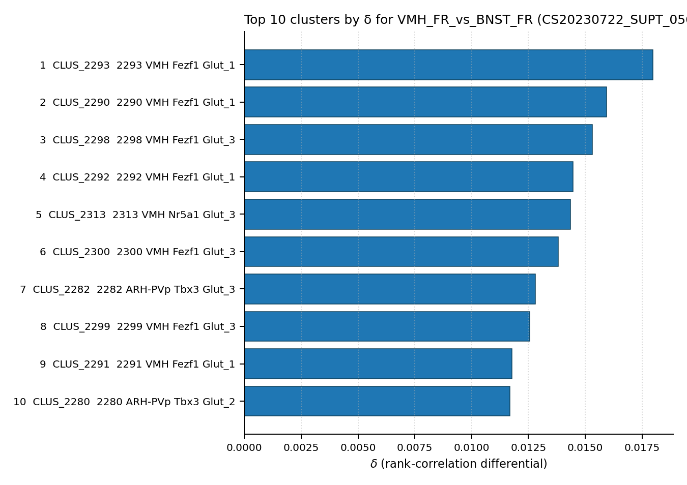
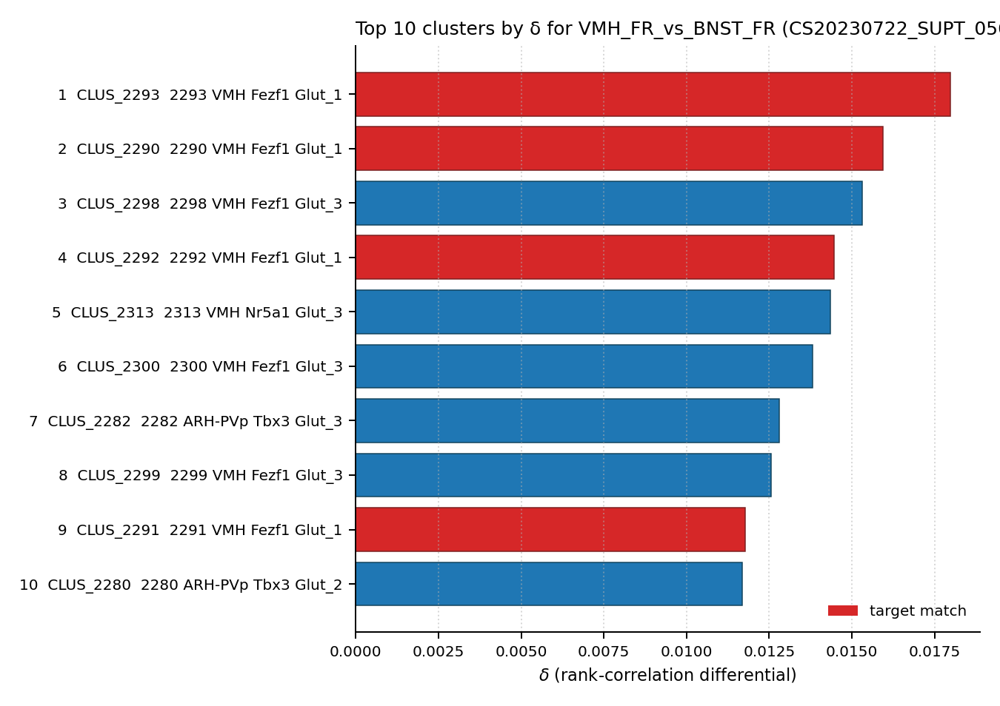

# VMHvl estrogen-receptor alpha / progesterone receptor neuron — WMBv1 Mapping Report
*draft · 2026-04-25 · Source: `/Users/do12/Documents/GitHub/BICAN_agentic_framework_planning/evidencell/kb/draft/sexually_dimorphic/20260425_sexually_dimorphic_report_ingest.yaml`*

**⚠ Draft mappings. Evidence is atlas-metadata only unless otherwise noted. All edges require expert review before use.**

---

## Introduction

The VMHvl estrogen-receptor alpha / progesterone receptor neuron is a molecularly
heterogeneous, predominantly glutamatergic population of the ventrolateral subdivision
of the ventromedial hypothalamus, defined by neurochemical criteria including ERα
(Esr1), progesterone receptor (Pgr), Nkx2-1, and Tac1 [1], [2]. Distinct functional
subpopulations have been described: a Pgr+ subset required for mating in both sexes
and for male fighting [2]; an ERα+/Nkx2-1+/Tac1+ subset that drives female-specific
locomotion [1]; and additional ERα-expressing subtypes with separate projection
targets and sex-related roles. Single-nucleus RNA-seq has identified 17 transcriptomic
types within this anatomical population, and the classical node is explicitly flagged
as heterogeneous and a candidate for splitting into multiple sub-nodes in future
iterations. Mapping this composite classical type to WMBv1 is therefore expected
to produce a small set of co-primary supertype targets rather than a single best
match, and the report should be read with that ambiguity in mind.

### Classical type table

| Property | Value | References |
|---|---|---|
| Soma location | Ventromedial hypothalamic nucleus [MBA:693] (ventrolateral subdivision, VMHvl) | [1] |
| Defining markers | Esr1, Nkx2-1, Tac1 (transcript) [1]; Pgr (transcript) [2] | [1], [2] |
| Neuropeptides | Tac1 | [1] |
| CL term | — (none assigned; candidate for new term) | |

Details — source evidence for classical type properties

- **Soma location / Esr1 / Nkx2-1 / Tac1:** primary literature, mouse, VMHvl-targeted Cre and pharmacogenetic dissection · [1]

  > Estrogen-receptor alpha (ERα) neurons in the ventrolateral region of the ventromedial hypothalamus (VMHVL) control an array of sex-specific responses to maximize reproductive success. In females, these VMHVL neurons are believed to coordinate metabolism and reproduction. However, it remains unknown whether specific neuronal populations control distinct components of this physiological repertoire. Here, we identify a subset of ERα VMHVL neurons that promotes hormone-dependent female locomotion. Activating Nkx2-1-expressing VMHVL neurons via pharmacogenetics elicits a female-specific burst of spontaneous movement, which requires ERα and Tac1 signaling. Disrupting the development of Nkx2-1(+) VMHVL neurons results in female-specific obesity, inactivity, and loss of VMHVL neurons coexpressing ERα and Tac1. Unexpectedly, two responses controlled by ERα(+) neurons, fertility and brown adipose tissue thermogenesis, are unaffected. We conclude that a dedicated subset of VMHVL neurons marked by ERα, NKX2-1, and Tac1 regulates estrogen-dependent fluctuations in physical activity and constitutes one of several neuroendocrine modules that drive sex-specific responses.
  > — Correa et al. 2015, Developmental and Hormonal Regulation · [1] <!-- quote_key: 27794167_af52b501 -->

- **Pgr marker:** review-level summary, mouse VMHvl, sex-typical behaviour context · [2]

  > Another molecularly defined sexually dimorphic VMHvl subpopulation that controls sex-typical behaviors in both sexes is the progesterone receptor (PR)-expressing neurons. This subpopulation is required for the normal display of mating in both sexes and for fighting in males [76].
  > — Zilkha et al. 2021, Sexually Dimorphic Brain Regions and Structures · [2] <!-- quote_key: 233446934_8cb6b0bc -->

---

## Results

Two co-primary mapping edges were assessed; both reach 🟡 MODERATE confidence as
CROSS_CUTTING targets — SUPT_0564 (VMH Fezf1 Glut_2), supported by atlas metadata
matching VMH location and Pgr/Nkx2-1 expression, and SUPT_0563 (VMH Fezf1 Glut_1),
added on the basis of an Esr1+ TRAP-seq bulk-correlation contrast (Knoedler 2022
[3]) that places three SUPT_0563 child clusters in the top four atlas-wide hits
for the VMH female-receptive vs BNST female-receptive δ.

### Mapping candidates

**Candidate overview.**

| Rank | WMBv1 cluster | Supertype | Cells (MERFISH) | Confidence | Key property alignment | Verdict |
|---|---|---|---|---|---|---|
| 1 | 0564 VMH Fezf1 Glut_2 [CS20230722_SUPT_0564] | (self) | n=360 (MBA:693 VMH dominant) | 🟡 MODERATE | VMH location CONSISTENT; Nkx2-1 CONSISTENT; Pgr APPROXIMATE | Best candidate (broader Pgr/Nkx2-1/Tac1 subpop.) |
| 1 | 0563 VMH Fezf1 Glut_1 [CS20230722_SUPT_0563] | (self) | n.r. ^ | 🟡 MODERATE | VMH location CONSISTENT; female-biased child clusters CONSISTENT (Knoedler 2022 δ ranks 1, 2, 4) | Best candidate (female-biased lordosis subpop.) |

2 edges total. Relationship type: CROSS_CUTTING (both edges; the heterogeneous classical
node is split across both supertypes).

^MERFISH cell count not separately recorded for SUPT_0563 in this facts file; child
clusters CLUS_2290, CLUS_2292, CLUS_2293 all have primary anatomy = Ventromedial
hypothalamic nucleus.

### 0564 VMH Fezf1 Glut_2 [CS20230722_SUPT_0564] · 🟡 MODERATE

**Property alignment — Table 1.**

| Property | Classical | Supertype | Best cluster | Alignment |
|---|---|---|---|---|
| Soma location | Ventromedial hypothalamic nucleus [MBA:693] (VMHvl) | MBA:693 (VMH) n=360, dominant location | not assessed | CONSISTENT |
| NT type | not stated; VMHvl predominantly glutamatergic | Glutamatergic (VMH Fezf1 Glut label) | not assessed | CONSISTENT |
| Nkx2-1 expression | POSITIVE (defining marker) | precomputed mean = 5.34 | not assessed | CONSISTENT |
| Pgr expression | POSITIVE (defining marker) | precomputed mean = 4.54 | not assessed | APPROXIMATE |
| Esr1 expression | POSITIVE (defining marker) | precomputed mean = 2.35 | not assessed | APPROXIMATE |
| Tac1 expression | POSITIVE (defining marker, neuropeptide) | precomputed mean = 1.39 | not assessed | APPROXIMATE |
| Sex ratio | female-biased lordosis subpopulation expected (subset only) | not available | not available at supertype level | NOT_ASSESSED |

**Evidence support — Table 2.**

| Evidence | Type | Supports | Headline | Source |
|---|---|---|---|---|
| SUPT_0564 atlas metadata (VMH n=360; Nkx2-1, Pgr, Esr1, Tac1) | Atlas metadata | PARTIAL | MBA:693 n=360; Nkx2-1=5.34, Pgr=4.54, Esr1=2.35, Tac1=1.39 | atlas-internal |
| Knoedler 2022 TRAP-seq VMH_FR vs BNST_FR (target SUPT_0564) | Bulk transcriptomic correlation | PARTIAL | SUPT_0564 not in top 20 by δ; companion SUPT_0563 takes ranks 1, 2, 4 | [3] |

*(Child-cluster breakdown not assessed — see proposed experiments. Three of the top four atlas-wide hits in the Knoedler 2022 VMH_FR vs BNST_FR contrast belong to the companion supertype SUPT_0563 rather than to SUPT_0564 itself.)*

#### Supporting evidence

- **VMH location is the dominant atlas anatomy for SUPT_0564.** MBA:693 (Ventromedial hypothalamic nucleus) is recorded as the primary location with n=360 cells, directly matching the classical soma annotation [1].
- **Nkx2-1 is strongly expressed at supertype level** (precomputed mean = 5.34), consistent with the Nkx2-1+ defining role established in [1].
- **Pgr is moderately expressed** (mean = 4.54), partly supporting the Pgr+ subpopulation reported in [2]; subset expression is consistent with the heterogeneity of the classical type.
- **Glutamatergic NT identity** matches the VMH Fezf1 Glut label (CONSISTENT alignment).
- **Independent quantitative cross-check from bulk-correlation [3].** SUPT_0564 itself does not appear in the top 20 by δ in the VMH_FR vs BNST_FR contrast; instead three of the top four hits belong to the companion supertype SUPT_0563. This supports a CROSS_CUTTING split of the classical type across the two supertypes rather than a single SUPT_0564 mapping:

  > Knoedler 2022 (PMID:35143761) Esr1+ TRAP-seq pooled VMH female-receptive vs BNST female-receptive. SUPT_0564 itself does not appear in the top 20 by δ — instead, SUPT_0563 takes 3 of the top 4 (CLUS_2293, 2290, 2292). This is independent quantitative support for the open question already raised on this edge: SUPT_0563 should be added as a co-primary CROSS_CUTTING target. SUPT_0564 retains its existing ATLAS_METADATA support but should not be the sole mapping target.
  > — Knoedler et al. 2022 · [3]

  

#### Marker evidence provenance

- **Esr1** (mean = 2.35, APPROXIMATE) — moderate atlas expression. Esr1 marks a defining subset, not the full SUPT_0564 supertype; the dilution is expected for a heterogeneous supertype. *(note: Esr1+ neurons span multiple VMH supertypes — the moderate atlas mean is consistent with Esr1 being a subset marker of SUPT_0564, not a defining feature of every cell.)*
- **Tac1** (mean = 1.39, APPROXIMATE) — low atlas expression; consistent with the small Esr1+/Nkx2-1+/Tac1+ subset described in [1]. Tac1 is also listed as a neuropeptide on the classical node, sourced from the same primary study [1]; the low supertype mean does not refute the existence of a Tac1+ subset but does indicate that Tac1+ cells are a minority within SUPT_0564.
- **Pgr** (mean = 4.54, APPROXIMATE) — moderate atlas expression. Classical evidence is review-level [2]; primary literature on PR+ VMHvl neurons exists but is not directly cited on the node, which is a weak-evidence flag for this marker.
- **Nkx2-1** (mean = 5.34, CONSISTENT) — the strongest marker alignment for this edge. Atlas evidence is transcript-based; classical evidence [1] also relies on Nkx2-1 transgenic targeting at protein level, so the data sources are complementary and concordant.

#### Concerns

- **Heterogeneity / ambiguous mapping.** VMHvl contains 17 transcriptomic types (Kim 2019 — referenced in classical node notes; not in `reference_index`). The classical node spans multiple functional subpopulations and a single SUPT_0564 mapping is incomplete; SUPT_0563 should be retained as a co-primary target (see below).
- **Calb1 is the highest-expressed gene in SUPT_0564 (mean = 8.0), but is not a defining marker** of vmhvl_esr1_pr_neuron. Calb1 is a canonical marker of the distinct SDN-POA calbindin neuron — high Calb1 in SUPT_0564 warrants primary literature verification to confirm that SUPT_0564 represents the ERα/PR VMHvl population rather than a Calb1+ subtype.
- **Esr1 / Tac1 atlas means are below the threshold** for these to be DEFINING atlas markers of SUPT_0564, even though they are defining features of the classical type. This is consistent with subset expression but limits the strength of supertype-level support.
- **No direct child-cluster assessment was performed for SUPT_0564** in the current edge YAML — the Knoedler 2022 δ ranking covers all atlas clusters but no SUPT_0564 child cluster is in the top 20.

#### What would upgrade confidence

- Cluster-level Esr1, Pgr, Nkx2-1, Tac1 co-expression analysis across SUPT_0564 child clusters; expected output: refined `property_comparisons` and possibly a child-cluster MODERATE/HIGH edge to a specific Pgr+ cluster.
- Targeted literature search for primary studies on VMHvl PR+ neurons (the Pgr citation [2] is review-level); expected output: replace [2] with a primary citation supporting Pgr as a defining marker.
- MapMyCells annotation transfer of an external VMHvl PR-Cre or ERα-Cre scRNA-seq dataset against WMBv1 at F1 ≥ 0.50 (SUPT_0564) or F1 ≥ 0.80 (cluster-level); expected output: `AnnotationTransferEvidence` distinguishing the SUPT_0563 vs SUPT_0564 split.

### 0563 VMH Fezf1 Glut_1 [CS20230722_SUPT_0563] · 🟡 MODERATE

**Property alignment — Table 1.**

| Property | Classical | Supertype | Best cluster | Alignment |
|---|---|---|---|---|
| Soma location | Ventromedial hypothalamic nucleus [MBA:693] (VMHvl) | MBA:693 (VMH) primary location across child clusters | CLUS_2290, CLUS_2292, CLUS_2293 — all primary anat = VMH | CONSISTENT |
| NT type | not stated; VMHvl predominantly glutamatergic | Glutamatergic (VMH Fezf1 Glut label) | Glutamatergic | CONSISTENT |
| Sex ratio | female-biased lordosis subpopulation expected | not available at supertype level | MFR=0.08 (CLUS_2290), MFR=0.12 (CLUS_2292) — both strongly female-biased | CONSISTENT |

**Evidence support — Table 2.**

| Evidence | Type | Supports | Headline | Source |
|---|---|---|---|---|
| Knoedler 2022 TRAP-seq VMH_FR vs BNST_FR (target SUPT_0563) | Bulk transcriptomic correlation | SUPPORT | best child CLUS_2293 rank 1/5322, δ=0.0180; CLUS_2290 rank 2 (MFR=0.08); CLUS_2292 rank 4 (MFR=0.12); 3 of top 20 are SUPT_0563 children | [3] |

*(3 of the top-20 child-cluster hits in the Knoedler 2022 VMH_FR vs BNST_FR contrast — CLUS_2290, CLUS_2292, CLUS_2293 — belong to SUPT_0563; CLUS_2290 and CLUS_2292 also carry the strongest female bias in the contrast (MFR=0.08, 0.12). Best match: CLUS_2293 (rank 1 of 5322).)*

#### Supporting evidence

- **Atlas-wide top-rank hit on a VMHvl-relevant bulk-correlation contrast [3].** SUPT_0563 child clusters take three of the top four positions by δ = ρ(VMH_FR) − ρ(BNST_FR), with CLUS_2293 ranked 1/5322 (δ=0.0180):

  > Knoedler 2022 (PMID:35143761) Esr1+ TRAP-seq pooled VMH female-receptive vs BNST female-receptive. SUPT_0563 takes three of the top four child-cluster positions by δ = ρ(VMH_FR) − ρ(BNST_FR): CLUS_2293 (rank 1, δ=0.0180), CLUS_2290 (rank 2, δ=0.0159, MFR=0.08), CLUS_2292 (rank 4, δ=0.0145, MFR=0.12). The female-biased CLUS_2290 and CLUS_2292 directly correspond to the lordosis-circuit subpopulation flagged in vmhvl_esr1_pr_neuron's classical definition. SUPT_0563 was missed by the rank-1 DB query (no DEFINING_SCOPED markers in atlas metadata for this supertype) and is added here as a co-primary CROSS_CUTTING target alongside SUPT_0564 based on the bulk-correlation evidence.
  > — Knoedler et al. 2022 · [3]

  

- **VMH soma location** is the primary anatomical annotation across all three top SUPT_0563 child clusters (CLUS_2290, CLUS_2292, CLUS_2293; all primary anat = Ventromedial hypothalamic nucleus), CONSISTENT with the MBA:693 classical soma location [1].
- **Glutamatergic NT type** is concordant (VMH Fezf1 Glut label, CONSISTENT).
- **Sex ratio in the top child clusters is strongly female-biased** — CLUS_2290 MFR=0.08 and CLUS_2292 MFR=0.12 — directly matching the female-biased lordosis subpopulation flagged in the classical node's definition [1]. (Sex ratio is NULL at supertype level; the signal lives entirely in the female-biased child clusters that the bulk correlation also surfaces.)

#### Marker evidence provenance

- **No defining-marker atlas annotations** are recorded for SUPT_0563 in the current edge YAML — the supertype was missed by the rank-1 DB query because it carries no DEFINING_SCOPED markers in atlas metadata. Per-marker precomputed expression values for Esr1/Pgr/Nkx2-1/Tac1 at SUPT_0563 child clusters are not in `property_comparisons` and so cannot be assessed here. This is the primary gap in the SUPT_0563 evidence base; the bulk-correlation evidence anchors the mapping but cannot replace per-marker confirmation at cluster level.
- **Sex ratio is the strongest cluster-level marker** for SUPT_0563 — CLUS_2290 (MFR=0.08) and CLUS_2292 (MFR=0.12) are both strongly female-biased, consistent with the lordosis-circuit subpopulation [1].

#### Concerns

- **Co-primary / ambiguous mapping with SUPT_0564.** The classical type is heterogeneous; SUPT_0563 captures the female-biased lordosis subpopulation, SUPT_0564 captures the broader Pgr+/Nkx2-1+/Tac1+ population. Both edges should be retained until the classical node is split or finer-grained data resolves the boundary.
- **Marker-level atlas confirmation is missing.** Esr1, Pgr, Nkx2-1, Tac1 precomputed values for SUPT_0563 child clusters were not assessed in the current edge YAML; the mapping rests on bulk-correlation rank + sex bias + soma anatomy without independent single-cell marker support.
- **Classical sex ratio at supertype level is NULL.** The sex-bias signal is concentrated in two of several SUPT_0563 child clusters (CLUS_2290, CLUS_2292) — consistent with a subset-of-supertype interpretation, but caveat that not all SUPT_0563 cells are female-biased.

#### What would upgrade confidence

- Cluster-level Esr1, Pgr, Nkx2-1, Tac1 co-expression in CLUS_2290, CLUS_2292, CLUS_2293 vs the female-biased clusters of SUPT_0564 — distinguishes the two SUPT mappings; expected output: refined `property_comparisons` and per-cluster MODERATE/HIGH edges.
- MapMyCells annotation transfer of published VMHvl ERα-Cre or PR-Cre scRNA-seq data to WMBv1 at F1 ≥ 0.50 (supertype) / F1 ≥ 0.80 (cluster); expected output: `AnnotationTransferEvidence` quantifying the SUPT_0563 vs SUPT_0564 split.

---

Methods — data sources, analyses, and reproducibility receipts

**Classical type definition.** vmhvl_esr1_pr_neuron is defined on a CLASSICAL_NEUROCHEMICAL
basis: defining markers Esr1, Nkx2-1, Tac1 (transcript) [1] and Pgr (transcript) [2];
neuropeptide Tac1 [1]; soma location Ventromedial hypothalamic nucleus [MBA:693] (ventrolateral
subdivision) [1]. NT type is not directly stated on the classical node but VMHvl neurons
are predominantly glutamatergic. The classical node is explicitly heterogeneous — 17
transcriptomic types reported by snRNA-seq within the same anatomical population — and is
flagged as a candidate for splitting into multiple sub-nodes in future iterations. No CL
term is currently assigned.

**Atlas mapping query.** Candidate atlas clusters were retrieved from the WMBv1
taxonomy (CCN20230722) at ranks 0 (cluster) and 1 (supertype) using metadata-based
scoring (region match, NT type, defining markers, sex bias when applicable). Full
scoring rules: `workflows/map-cell-type.md`.

**Property alignment.** Each defining property of the classical type was compared to
the corresponding atlas-side value via the `property_comparisons` schema, with
alignments graded CONSISTENT / APPROXIMATE / DISCORDANT / NOT_ASSESSED. Atlas-side
numerical values came from precomputed expression on the cluster (cluster.yaml in
the taxonomy reference store) and from MERFISH spatial registration for soma
location.

**Bulk transcriptomic correlation.**

| Field | Value |
|---|---|
| Source publication | Knoedler et al. 2022 · PMID:35143761 · [3] |
| GEO accession | GSE183092 |
| Technique | TRAP-seq |
| n pools | 12 |
| Atlas | CCN20230722 (SHA-256: b21ca985) |
| Statistic | spearman_rho |
| Parameters | pseudobulk_transform=log1p(sum/n_cells); pool_transform=log1p(replicate_mean(DESeq2_normalised_counts)); gene_id_space=ensembl_mouse_via_symbol_lookup (conf/gene_mapping_CCN20230722.tsv); gene_intersection=intersection_across_4_regions∩atlas_col_names; n_replicates_per_pool=3. |
| Script | [correlate.py](https://github.com/Cellular-Semantics/evidencell/blob/4e67d6b/kb/correlation_runs/corr_run_20260428_knoedler_esr1_wmbv1/correlate.py) |
| Code version | 4e67d6b |
| Caveats | Cross-sex within-region δ contrasts (Male vs FR or Male vs FNR) are artefactual: across all three regions tested (POA, VMH, BNST) the top hits are hindbrain Calcb cholinergic motor neurons — a global male-vs-female expression bias that swamps region-specific signals. Methodological rule: paired-bulk δ requires the two pools to differ in cell population (region/marker/state) holding sex constant; cross-sex δ within a single population is not a valid use of this method. TRAP-seq vs scRNA-seq pseudobulk: polysome-bound mRNA shifts absolute ρ values lower than for FACS-bulk inputs (Stephens-style), but Spearman rank-based statistics handle the magnitude offset; δ rankings are comparable across the two run types. |

**Atlas data sources.**
- WMBv1 · taxonomy_id CCN20230722 · pseudobulk source `conf/mapmycells/CCN20230722/precomputed_stats.h5` · SHA-256 `b21ca985652fb25f9608f99005139a40757133a76fbe845ae5b175c5c26a447b`.

**Anti-hallucination.** All citations, atlas accessions, ontology CURIEs, and verbatim
literature quotes in this report are validated against the evidencell knowledge base
at write time. Authored-prose evidence narratives are validated against their source
`evidence_items[*].explanation` fields. The pre-write hook rejects any unresolvable
identifier or unattributed blockquote. Specific mapping limitations and caveats are
documented per-candidate in the Discussion section.

**Evidence base.**

| Edge ID | Evidence types | Supports | Source |
|---|---|---|---|
| edge_vmhvl_esr1_pr_neuron_to_cs20230722_supt_0564 | ATLAS_METADATA; BULK_CORRELATION | PARTIAL; PARTIAL | atlas-internal; [3] |
| edge_vmhvl_esr1_pr_neuron_to_cs20230722_supt_0563 | BULK_CORRELATION | SUPPORT | [3] |

*Generated by evidencell `860919b` at 2026-04-30T09:04:16+00:00 from [/Users/do12/Documents/GitHub/BICAN_agentic_framework_planning/evidencell/kb/draft/sexually_dimorphic/20260425_sexually_dimorphic_report_ingest.yaml](/Users/do12/Documents/GitHub/BICAN_agentic_framework_planning/evidencell/kb/draft/sexually_dimorphic/20260425_sexually_dimorphic_report_ingest.yaml).*

---

## Discussion

**Primary mapping:** vmhvl_esr1_pr_neuron is mapped as two co-primary CROSS_CUTTING
edges, both at 🟡 MODERATE confidence: 0564 VMH Fezf1 Glut_2 [CS20230722_SUPT_0564]
(supported by ATLAS_METADATA — VMH location n=360, Nkx2-1 = 5.34, Pgr = 4.54) and
0563 VMH Fezf1 Glut_1 [CS20230722_SUPT_0563] (supported by BulkCorrelationEvidence
from Knoedler 2022 [3] — three child clusters in the top four atlas-wide hits, two
of which carry strong female bias). Key caveats: AMBIGUOUS_MAPPING (the heterogeneous
classical type splits across the two supertypes); MARKER_NOT_SPECIFIC (Calb1 is the
top-expressed gene in SUPT_0564 but is not a defining marker, requiring primary
literature verification).

No Cell Ontology term currently assigned. This classical node is a candidate for
contribution of one or more new CL terms — the population is heterogeneous with
17 reported transcriptomic types and may need to be split into multiple sub-nodes
before a single CL term can be assigned cleanly.

### Proposed experiments and follow-ups

#### 1. Cluster-level co-expression of Esr1, Pgr, Nkx2-1, Tac1 across SUPT_0563 and SUPT_0564 child clusters

**What:** Pull precomputed expression for Esr1, Pgr, Nkx2-1, Tac1 across all child
clusters of SUPT_0563 (CLUS_2290, 2291, 2292, 2293) and SUPT_0564, with particular
attention to the Knoedler-2022 top hits (CLUS_2290, 2292, 2293) and to the female-biased
clusters by MFR.

**Target:** Distinguish a Pgr+/Nkx2-1+/Tac1+ subset from a female-biased Esr1+ subset
across the two supertypes; identify which child clusters anchor each functional split.

**Expected output:** Refined `property_comparisons` for both edges; potentially
new MODERATE/HIGH cluster-level edges (e.g. to CLUS_2290, 2292, or 2293).

**Resolves:** Open questions 1 and 2 (SUPT_0563 vs SUPT_0564 split; CLUS_2290 vs
CLUS_2292 distinct subtypes vs replicates); the Calb1 caveat on SUPT_0564.

#### 2. MapMyCells annotation transfer of external VMHvl ERα/PR scRNA-seq

**What:** Run MapMyCells against WMBv1 using a published VMHvl ERα-Cre or PR-Cre
sorted scRNA-seq dataset (e.g. Kim 2019 or comparable VMHvl-targeted snRNA-seq).

**Target:** F1 ≥ 0.50 at supertype; F1 ≥ 0.80 at cluster level; expect F1 to split
between SUPT_0563 (female-biased) and SUPT_0564 (broader Pgr+/Nkx2-1+).

**Expected output:** `AnnotationTransferEvidence` entries on both edges,
quantifying the proportion of cells assigned to each supertype.

**Resolves:** Open question 1 (SUPT_0563 vs SUPT_0564 clean split or further
heterogeneity); the missing per-marker confirmation on SUPT_0563.

#### 3. Targeted literature search for primary VMHvl PR+ marker evidence

**What:** Cite-traverse from [2] (review-level Pgr citation) to primary studies
on Pgr expression and function in VMHvl neurons.

**Target:** Replace the review-level [2] with a primary citation; resolve whether
Pgr+ VMHvl neurons preferentially correspond to SUPT_0563 or SUPT_0564.

**Expected output:** Updated `defining_markers[*].refs` on the classical node;
potentially a new LITERATURE evidence item on whichever edge gains primary support.

**Resolves:** The marker-evidence-provenance flag on Pgr (currently sourced only
from a review).

### Open questions

1. **(SUPT_0563 edge)** Is SUPT_0563 vs SUPT_0564 a clean female-vs-broader split,
   or do both supertypes contain heterogeneous sub-populations that cross-cut the
   classical definition?
2. **(SUPT_0563 edge)** Are CLUS_2290 and CLUS_2292 distinct functional subtypes
   within SUPT_0563, or replicates of the same lordosis subpopulation?
3. **(SUPT_0564 edge)** Does Calb1 (highest-expressed gene in SUPT_0564, mean = 8.0)
   co-localise with Esr1/Pgr in VMHvl neurons, or does it mark a distinct
   subpopulation within SUPT_0564 — potentially the SDN-POA calbindin neuron
   contaminant?

---

## References

| # | Citation | PMID | Used for |
|---|---|---|---|
| [1] | Correa et al. 2015 | [PMID:25543145](https://pubmed.ncbi.nlm.nih.gov/25543145/) | Soma location (VMHvl); Esr1, Nkx2-1, Tac1 markers; Tac1 neuropeptide |
| [2] | Zilkha et al. 2021 | [PMID:33910083](https://pubmed.ncbi.nlm.nih.gov/33910083/) | Pgr marker (review-level) |
| [3] | Knoedler et al. 2022 | [PMID:35143761](https://pubmed.ncbi.nlm.nih.gov/35143761/) | Esr1+ TRAP-seq pooled VMH female-receptive vs BNST female-receptive bulk-correlation contrast against WMBv1 |
