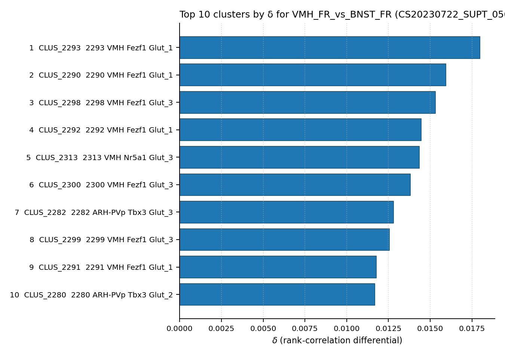
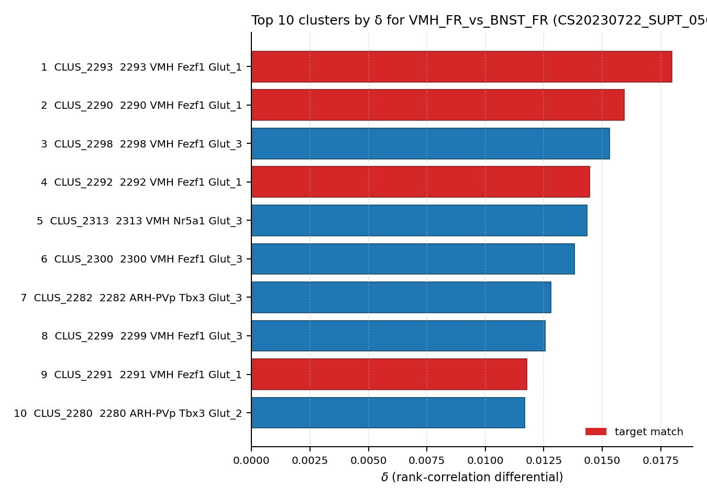

# VMHvl estrogen-receptor alpha / progesterone receptor neuron — WMBv1 Mapping Report
*2026-04-25 · Source: `/Users/do12/Documents/GitHub/BICAN_agentic_framework_planning/evidencell/kb/graphs/sexually_dimorphic/20260425_sexually_dimorphic_report_ingest.yaml`*

---

## Introduction

Estrogen-receptor alpha (ERα) neurons in the ventrolateral subdivision of the ventromedial hypothalamus (VMHvl) control sex-specific behaviour. A defined subset co-expressing Nkx2-1 and Tac1 drives female-specific locomotion and is required for normal energy balance and physical activity [1]. A partially overlapping VMHvl subpopulation marked by the progesterone receptor (Pgr) is required for mating in both sexes and for fighting in males [2]. Together these populations make VMHvl a model locus for sexually dimorphic physiology and a key test case for whether a heterogeneous classical type can be resolved into atlas transcriptomic clusters.

### Classical type table

| Property | Value | References |
|---|---|---|
| Soma location | Ventromedial hypothalamic nucleus [MBA:693] — ventrolateral subdivision (VMHvl) | [1] |
| Definition basis | CLASSICAL_NEUROCHEMICAL | — |
| Markers (defining) | Esr1, Pgr, Nkx2-1, Tac1 | [1], [2] |
| Neuropeptides | Tac1 | [1] |

Details — source evidence for classical type properties

- **Soma location / Esr1 / Nkx2-1 / Tac1:** Correa et al. 2015 · [1]
  > Estrogen-receptor alpha (ERα) neurons in the ventrolateral region of the ventromedial hypothalamus (VMHVL) control an array of sex-specific responses to maximize reproductive success. In females, these VMHVL neurons are believed to coordinate metabolism and reproduction. However, it remains unknown whether specific neuronal populations control distinct components of this physiological repertoire. Here, we identify a subset of ERα VMHVL neurons that promotes hormone-dependent female locomotion. Activating Nkx2-1-expressing VMHVL neurons via pharmacogenetics elicits a female-specific burst of spontaneous movement, which requires ERα and Tac1 signaling. Disrupting the development of Nkx2-1(+) VMHVL neurons results in female-specific obesity, inactivity, and loss of VMHVL neurons coexpressing ERα and Tac1. Unexpectedly, two responses controlled by ERα(+) neurons, fertility and brown adipose tissue thermogenesis, are unaffected. We conclude that a dedicated subset of VMHVL neurons marked by ERα, NKX2-1, and Tac1 regulates estrogen-dependent fluctuations in physical activity and constitutes one of several neuroendocrine modules that drive sex-specific responses.
  > — Correa et al. 2015, Developmental and Hormonal Regulation · [1] <!-- quote_key: 27794167_af52b501 -->
- **Marker Pgr:** Zilkha et al. 2021 · [2]
  > Another molecularly defined sexually dimorphic VMHvl subpopulation that controls sex-typical behaviors in both sexes is the progesterone receptor (PR)-expressing neurons. This subpopulation is required for the normal display of mating in both sexes and for fighting in males [76].
  > — Zilkha et al. 2021, Sexually Dimorphic Brain Regions and Structures · [2] <!-- quote_key: 233446934_8cb6b0bc -->

### Cell Ontology mapping

**No Cell Ontology term currently covers this type — candidate for a new CL term.** The classical node is acknowledged as molecularly heterogeneous: snRNA-seq (Kim 2019) identified 17 transcriptomic types within VMHvl, and the node groups Pgr+ (mating / male aggression), Esr1+/Nkx2-1+/Tac1+ (female locomotion), and additional Esr1+ subtypes with distinct projections. The node may need to be split into multiple sub-nodes in future iterations.

---

## Results

Two candidate WMBv1 supertypes were assessed; both are retained as co-primary CROSS_CUTTING mappings at MODERATE confidence. SUPT_0564 (VMH Fezf1 Glut_2) carries the broader Pgr+/Nkx2-1+/Tac1+ atlas-metadata signal; SUPT_0563 (VMH Fezf1 Glut_1) was added on the strength of bulk-correlation evidence and captures the female-biased lordosis-circuit child clusters that the rank-1 atlas-metadata query missed.

### Mapping candidates table

| Rank | WMBv1 cluster | Supertype | Cells (10x) | Confidence | Key property alignment | Verdict |
|---|---|---|---:|---|---|---|
| 1 | 0564 VMH Fezf1 Glut_2 [CS20230722_SUPT_0564] | SUPERTYPE | 621 | 🟡 MODERATE | Nkx2-1 CONSISTENT · Pgr APPROXIMATE | Best candidate (broader Pgr+/Nkx2-1+/Tac1+ subset) |
| 1 | 0563 VMH Fezf1 Glut_1 [CS20230722_SUPT_0563] | SUPERTYPE | 153 | 🟡 MODERATE | Location CONSISTENT · sex-bias CONSISTENT | Best candidate (female-biased lordosis subset) |

Total: 2 edges, both CROSS_CUTTING co-primary mappings.

### 0564 VMH Fezf1 Glut_2 · 🟡 MODERATE

**Property comparison**

| Property | Classical | Supertype | Best cluster | Alignment |
|---|---|---|---|---|
| Soma location | MBA:693 (VMHvl) | MBA:693 (VMH) n=360 (dominant location) | not assessed | CONSISTENT |
| NT type | not stated; VMHvl predominantly glutamatergic | Glutamatergic (VMH Fezf1 Glut label) | not assessed | CONSISTENT |
| Nkx2-1 expression | POSITIVE (transcript, defining marker) | precomputed mean_expression=5.34 | not assessed | CONSISTENT |
| Pgr expression | POSITIVE (transcript, defining marker) | precomputed mean_expression=4.54 | not assessed | APPROXIMATE |
| Esr1 expression | POSITIVE (transcript, defining marker) | precomputed mean_expression=2.35 | not assessed | APPROXIMATE |
| Tac1 expression | POSITIVE (transcript, defining marker and neuropeptide) | precomputed mean_expression=1.39 | not assessed | APPROXIMATE |
| Sex ratio | not documented for the broader Pgr+ subset | not available | not assessed | NOT_ASSESSED |

**Evidence support**

| Evidence | Type | Supports | Headline | Source |
|---|---|---|---|---|
| Atlas precomputed metadata | Atlas metadata | PARTIAL | VMH primary location n=360; Nkx2-1=5.34, Pgr=4.54, Esr1=2.35, Tac1=1.39 | atlas-internal |
| Knoedler 2022 TRAP-seq (VMH_FR vs BNST_FR) | Bulk transcriptomic correlation | PARTIAL | SUPT_0564 absent from top-20 δ; SUPT_0563 takes ranks 1, 2, 4 | [3] |

*(Child-cluster breakdown not assessed for SUPT_0564 specifically — see proposed experiments.)*

**Supporting evidence**

- Atlas metadata places SUPT_0564 with VMH (MBA:693) as primary location (n=360), directly matching VMHvl, and shows Nkx2-1 (5.34) and Pgr (4.54) at strong-to-moderate mean expression — consistent with the classical defining markers. Esr1 (2.35) and Tac1 (1.39) indicate subset expression.
- The Knoedler 2022 (PMID:35143761) TRAP-seq VMH_FR vs BNST_FR contrast is independent quantitative support; SUPT_0563 (not SUPT_0564) dominates the top of the δ ranking:

> Knoedler 2022 (PMID:35143761) Esr1+ TRAP-seq pooled VMH female-receptive vs BNST female-receptive. SUPT_0564 itself does not appear in the top 20 by δ — instead, SUPT_0563 takes 3 of the top 4 (CLUS_2293, 2290, 2292). This is independent quantitative support for the open question already raised on this edge: SUPT_0563 should be added as a co-primary CROSS_CUTTING target. SUPT_0564 retains its existing ATLAS_METADATA support but should not be the sole mapping target.
> — Knoedler et al. 2022 · [3]

**Marker evidence provenance**

- **Esr1, Nkx2-1, Tac1** — primary evidence is Correa et al. 2015 [1], which combines Cre-driver targeting (Nkx2-1-Cre), pharmacogenetic activation, and loss-of-function in Nkx2-1(+) VMHvl neurons; co-expression of ERα and Tac1 was confirmed in the targeted population. Cell-type specificity is therefore well grounded for the Nkx2-1+/Tac1+/Esr1+ subset, though the classical type is broader.
- **Pgr** — sourced from Zilkha et al. 2021 [2], a review citing primary functional perturbation work. A primary-source citation testing Pgr co-localisation with Esr1/Nkx2-1 in VMHvl would strengthen this row.

**Concerns**

- Pgr (APPROXIMATE), Esr1 (APPROXIMATE), Tac1 (APPROXIMATE): supertype-level mean expression is intermediate, consistent with each marker tagging a *subset* of SUPT_0564 rather than the full supertype — expected for a heterogeneous classical type but means no single child cluster is unambiguously identified at this resolution.
- AMBIGUOUS_MAPPING: VMHvl contains 17 transcriptomic types (Kim 2019). The classical node spans multiple functional subtypes; SUPT_0563 (parent of the two most female-biased rank-0 clusters CLUS_2290 MFR=0.08, CLUS_2292 MFR=0.12) was not retrieved in the rank-1 DB query and is added as a co-primary target on this report (see next section).
- MARKER_NOT_SPECIFIC: Calb1 has the highest mean expression in SUPT_0564 (mean=8.0) but is not a defining marker of vmhvl_esr1_pr_neuron and is the canonical marker of the distinct SDN-POA calbindin neuron. *(note: SUPT_0564 may therefore carry a mixed identity; targeted primary-literature verification of Calb1 co-localisation with Esr1/Pgr in VMHvl is warranted.)*

**What would upgrade confidence**

- Cluster-level co-expression analysis of Esr1, Pgr, Nkx2-1, Tac1 across SUPT_0564 child clusters (identify the specific child cluster carrying the broader Pgr+/Nkx2-1+/Tac1+ profile vs the female-biased subset captured by SUPT_0563).
- Targeted literature search for Calb1 / VMHvl ERα+ co-localisation to disambiguate the unexpectedly high Calb1 signal.
- AnnotationTransferEvidence from a published VMHvl Pgr-Cre or ERα-Cre scRNA-seq dataset mapped to WMBv1 (target F1 ≥ 0.5 at SUPERTYPE for SUPT_0564 to confirm the broader subset).

### 0563 VMH Fezf1 Glut_1 · 🟡 MODERATE

**Property comparison**

| Property | Classical | Supertype | Best cluster | Alignment |
|---|---|---|---|---|
| Soma location | MBA:693 (VMHvl) | MBA:693 (VMH) primary location across child clusters | MBA:693 (VMH) in CLUS_2290, CLUS_2292, CLUS_2293 | CONSISTENT |
| NT type | not stated; VMHvl predominantly glutamatergic | Glutamatergic (VMH Fezf1 Glut label) | Glutamatergic | CONSISTENT |
| Sex ratio | female-biased lordosis subpopulation expected | not available | MFR=0.08 (CLUS_2290), MFR=0.12 (CLUS_2292) | CONSISTENT |

*(2 of the SUPT_0563 child clusters surfaced in the bulk-correlation top-4 — CLUS_2290 and CLUS_2292 — show strong female bias (MFR=0.08 and 0.12); a third top-4 hit CLUS_2293 lacks MFR. Sex-bias at supertype level is NULL; the signal is concentrated in the female-biased child clusters.)*

**Evidence support**

| Evidence | Type | Supports | Headline | Source |
|---|---|---|---|---|
| Knoedler 2022 TRAP-seq (VMH_FR vs BNST_FR) | Bulk transcriptomic correlation | SUPPORT | CLUS_2293 rank 1 of 5322 (δ=0.0180); CLUS_2290 rank 2; CLUS_2292 rank 4; 3 of top 20 are SUPT_0563 children | [3] |

**Supporting evidence**

- Three of the top four child clusters in the Knoedler 2022 VMH_FR vs BNST_FR δ ranking are SUPT_0563 children, including the two most female-biased clusters in the response set:

> Knoedler 2022 (PMID:35143761) Esr1+ TRAP-seq pooled VMH female-receptive vs BNST female-receptive. SUPT_0563 takes three of the top four child-cluster positions by δ = ρ(VMH_FR) − ρ(BNST_FR): CLUS_2293 (rank 1, δ=0.0180), CLUS_2290 (rank 2, δ=0.0159, MFR=0.08), CLUS_2292 (rank 4, δ=0.0145, MFR=0.12). The female-biased CLUS_2290 and CLUS_2292 directly correspond to the lordosis-circuit subpopulation flagged in vmhvl_esr1_pr_neuron's classical definition. SUPT_0563 was missed by the rank-1 DB query (no DEFINING_SCOPED markers in atlas metadata for this supertype) and is added here as a co-primary CROSS_CUTTING target alongside SUPT_0564 based on the bulk-correlation evidence.
> — Knoedler et al. 2022 · [3]

| Rank | Cluster | Supertype | δ | MFR | Top anatomy |
|---:|---|---|---:|---:|---|
| **1** | **CLUS_2293** | **SUPT_0563** | **0.0180** | — | Ventromedial hypothalamic nucleus |
| **2** | **CLUS_2290** | **SUPT_0563** | **0.0159** | 0.08 | Ventromedial hypothalamic nucleus |
| 3 | CLUS_2298 | SUPT_0565 | 0.0153 | 1.7 | Tuberal nucleus |
| **4** | **CLUS_2292** | **SUPT_0563** | **0.0145** | 0.12 | Ventromedial hypothalamic nucleus |
| 5 | CLUS_2313 | SUPT_0568 | 0.0143 | 1.94 | Ventromedial hypothalamic nucleus |
| 6 | CLUS_2300 | SUPT_0565 | 0.0138 | 0.92 | Ventromedial hypothalamic nucleus |
| 7 | CLUS_2282 | SUPT_0556 | 0.0128 | 0.11 | Arcuate hypothalamic nucleus |
| 8 | CLUS_2299 | SUPT_0565 | 0.0126 | 3.17 | Ventromedial hypothalamic nucleus |
| **9** | **CLUS_2291** | **SUPT_0563** | **0.0118** | 1.27 | Ventromedial hypothalamic nucleus |
| 10 | CLUS_2280 | SUPT_0555 | 0.0117 | 1.0 | Arcuate hypothalamic nucleus |

**Marker evidence provenance**

- SUPT_0563 was not surfaced by the rank-1 atlas-metadata query because it lacks DEFINING_SCOPED markers for Esr1/Pgr/Nkx2-1/Tac1 in the atlas metadata at supertype level — yet its child clusters dominate a sex-biased VMH-vs-BNST bulk contrast targeting Esr1+ neurons. This is a flag that supertype-level atlas annotation can miss subpopulations that are nonetheless captured at child-cluster resolution and by orthogonal bulk transcriptomic evidence.

**Concerns**

- AMBIGUOUS_MAPPING: co-primary with SUPT_0564. The classical type is heterogeneous; SUPT_0563 captures the female-biased lordosis subpopulation, SUPT_0564 captures the broader Pgr+/Nkx2-1+/Tac1+ subpopulation. Both edges are retained until the classical node is split or finer-grained analysis disentangles them.
- Sex-bias supertype-level value is NULL — only available at the child-cluster level (CLUS_2290 MFR=0.08, CLUS_2292 MFR=0.12). Direct supertype-vs-supertype comparison on this property is therefore not possible.

**What would upgrade confidence**

- Cluster-level co-expression of Esr1, Pgr, Nkx2-1, Tac1 in CLUS_2290, 2292, 2293 vs the female-biased clusters of SUPT_0564, to distinguish the two SUPT mappings.
- MapMyCells annotation transfer of published VMHvl ERα-Cre or PR-Cre scRNA-seq data to WMBv1 (target: AnnotationTransferEvidence with F1 split between SUPT_0563 female-biased and SUPT_0564 broader; F1 ≥ 0.50 at SUPERTYPE).

---

### Methods

Data sources, analyses, and reproducibility receipts

**Classical type definition.** vmhvl_esr1_pr_neuron is a CLASSICAL_NEUROCHEMICAL node defined by co-expression of Esr1, Pgr, Nkx2-1, and Tac1 (the last also annotated as a neuropeptide) in the ventrolateral subdivision of the ventromedial hypothalamic nucleus (MBA:693 VMHvl) [1], [2]. Neurotransmitter type is not stated on the node but the VMHvl population is predominantly glutamatergic. The classical node is acknowledged as heterogeneous — encompassing Pgr+ (mating in both sexes / male fighting), Esr1+/Nkx2-1+/Tac1+ (female locomotion), and additional Esr1+ subtypes — and corresponds to ~17 transcriptomic types in VMHvl by snRNA-seq (Kim 2019).

**Atlas mapping query.** Candidate atlas clusters were retrieved from the WMBv1 taxonomy (CCN20230722) at ranks 0 (cluster) and 1 (supertype) using metadata-based scoring (region match, NT type, defining markers, sex bias when applicable). Full scoring rules: `workflows/map-cell-type.md`.

**Property alignment.** Each defining property of the classical type was compared to the corresponding atlas-side value via the `property_comparisons` schema, with alignments graded CONSISTENT / APPROXIMATE / DISCORDANT / NOT_ASSESSED. Atlas-side numerical values came from precomputed expression on the cluster (cluster.yaml in the taxonomy reference store) and from MERFISH spatial registration for soma location.

**Bulk transcriptomic correlation.**

| Field | Value |
|---|---|
| Source publication | Knoedler et al. 2022 · PMID:35143761 [3] |
| GEO accession | GSE183092 |
| Technique | TRAP-seq |
| n pools | 12 |
| Atlas | CCN20230722 (SHA-256: b21ca985) |
| Statistic | spearman_rho |
| Parameters | pseudobulk_transform=log1p(sum/n_cells); pool_transform=log1p(replicate_mean(DESeq2_normalised_counts)); gene_id_space=ensembl_mouse_via_symbol_lookup (conf/gene_mapping_CCN20230722.tsv); gene_intersection=intersection_across_4_regions∩atlas_col_names; n_replicates_per_pool=3. |
| Script | correlate.py |
| Code version | 4e67d6b |
| Caveats | Cross-sex within-region δ contrasts (Male vs FR or Male vs FNR) are artefactual: across all three regions tested (POA, VMH, BNST) the top hits are hindbrain Calcb cholinergic motor neurons — a global male-vs-female expression bias that swamps region-specific signals. METHODOLOGICAL RULE: paired-bulk δ requires the two pools to differ in cell population (region/marker/state) holding sex constant. Cross-sex δ within a single population is not a valid use of this method. TRAP-seq vs scRNA-seq pseudobulk: polysome-bound mRNA shifts absolute ρ values lower than for FACS-bulk inputs, but Spearman rank-based statistics handle the magnitude offset; δ rankings are comparable across the two run types. |

**Atlas data sources.**

- WMBv1 / CCN20230722 — pseudobulk source `conf/mapmycells/CCN20230722/precomputed_stats.h5` (SHA-256: `b21ca985652fb25f9608f99005139a40757133a76fbe845ae5b175c5c26a447b`).

**Anti-hallucination.** All citations, atlas accessions, ontology CURIEs, and verbatim literature quotes in this report are validated against the evidencell knowledge base at write time. Authored-prose evidence narratives are validated against their source `evidence_items[*].explanation` fields. The pre-write hook rejects any unresolvable identifier or unattributed blockquote. Specific mapping limitations and caveats are documented per-candidate in the Discussion section.

*Generated by evidencell `01f89d6` at 2026-05-13T15:46:20+00:00 from [kb/graphs/sexually_dimorphic/20260425_sexually_dimorphic_report_ingest.yaml](kb/graphs/sexually_dimorphic/20260425_sexually_dimorphic_report_ingest.yaml).*

**Evidence base table**

| Edge ID | Evidence types | Supports | Source |
| --- | --- | --- | --- |
| edge_vmhvl_esr1_pr_neuron_to_cs20230722_supt_0564 | ATLAS_METADATA; BULK_CORRELATION | PARTIAL; PARTIAL | atlas-internal, [3] |
| edge_vmhvl_esr1_pr_neuron_to_cs20230722_supt_0563 | BULK_CORRELATION | SUPPORT | [3] |

---

## Discussion

**Primary mapping:** VMHvl estrogen-receptor alpha / progesterone receptor neuron → 0564 VMH Fezf1 Glut_2 [CS20230722_SUPT_0564] AND 0563 VMH Fezf1 Glut_1 [CS20230722_SUPT_0563] at MODERATE confidence (co-primary CROSS_CUTTING mappings). Key support: atlas metadata (VMH location, Nkx2-1 / Pgr expression) for SUPT_0564; Knoedler 2022 VMH_FR vs BNST_FR bulk correlation (3 of top 4 child clusters by δ, including the two most female-biased clusters MFR=0.08 and 0.12) for SUPT_0563. Key caveats: AMBIGUOUS_MAPPING (classical type is heterogeneous, ~17 transcriptomic types in VMHvl); MARKER_NOT_SPECIFIC (high Calb1 in SUPT_0564 not consistent with the classical definition).

No Cell Ontology term currently assigned. The classical node is acknowledged as heterogeneous and may need to be split into multiple sub-nodes (Pgr+ subset, female-biased Esr1+/Nkx2-1+/Tac1+ subset, and others); CL contribution is deferred until that split is curated.

### Proposed experiments and follow-ups

The two open experiments on the SUPT_0563 edge are not addressed by existing evidence items and are listed below. There are no proposed_experiments on the SUPT_0564 edge — the corresponding gap (best child-cluster identification within SUPT_0564) is rolled into experiment 1 below.

1. **Cluster-level marker co-expression analysis** in WMBv1 precomputed stats.
   - *Target:* identify SUPT_0563 vs SUPT_0564 child clusters that co-express Esr1, Pgr, Nkx2-1, Tac1 (and distinguish the female-biased lordosis subset from the broader Pgr+/Nkx2-1+/Tac1+ subset).
   - *Expected output:* MarkerAnalysisEvidence or refined ATLAS_METADATA evidence rows on both edges.
   - *Resolves:* Question 1 (clean split vs cross-cutting heterogeneity); Question 3 (Calb1 co-localisation in SUPT_0564); Question 4 (CLUS_2290 vs CLUS_2292 as distinct subtypes).

2. **Annotation transfer of published VMHvl ERα-Cre / PR-Cre scRNA-seq** to WMBv1 via MapMyCells.
   - *Target:* F1 ≥ 0.50 at SUPERTYPE; expected outcome is an F1 split between SUPT_0563 (female-biased) and SUPT_0564 (broader).
   - *Expected output:* AnnotationTransferEvidence on both edges.
   - *Resolves:* Question 2 (independent validation of the SUPT_0563 / SUPT_0564 co-primary mapping).

3. **Targeted cite-traverse for Calb1 / VMHvl ERα+ co-localisation** (literature search, no wet lab).
   - *Target:* primary studies that test Calb1 co-expression with Esr1 or Pgr in VMHvl ERα+ neurons (vs SDN-POA calbindin neurons).
   - *Expected output:* LiteratureEvidence row on the SUPT_0564 edge clarifying whether high Calb1 reflects a contaminating SDN-POA-like signal or a previously unreported VMHvl ERα+ subset.
   - *Resolves:* Question 3.

### Open questions

1. Does Calb1 co-localise with Esr1/Pgr in VMHvl neurons, or does it mark a distinct subpopulation within SUPT_0564? *(from SUPT_0564 edge)*
2. Is SUPT_0563 vs SUPT_0564 a clean female-vs-broader split, or do both supertypes contain heterogeneous sub-populations that cross-cut the classical definition? *(from SUPT_0563 edge)*
3. Are CLUS_2290 and CLUS_2292 distinct functional subtypes within SUPT_0563, or replicates of the same lordosis subpopulation? *(from SUPT_0563 edge)*

---

## References

| # | Citation | PMID | Used for |
|---|---|---|---|
| [1] | Correa et al. 2015 | [PMID:25543145](https://pubmed.ncbi.nlm.nih.gov/25543145/) | soma location |
| [2] | Zilkha et al. 2021 | [PMID:33910083](https://pubmed.ncbi.nlm.nih.gov/33910083/) | Pgr marker |
| [3] | Knoedler et al. 2022 | [PMID:35143761](https://pubmed.ncbi.nlm.nih.gov/35143761/) | Esr1+ TRAP-seq pooled VMH female-receptive vs BNST female-receptive bulk-correlation evidence ranking SUPT_0563 child clusters (CLUS_2293, 2290, 2292) in top 4 of 5,322 by δ |
